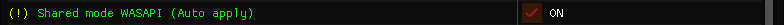
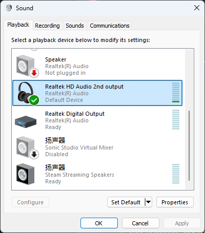
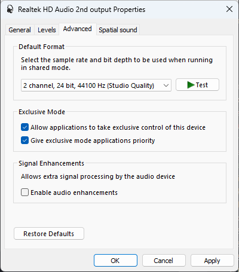
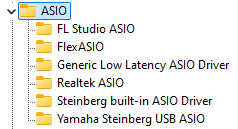
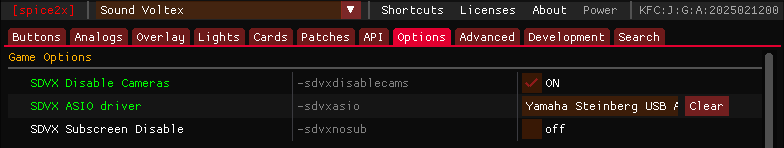

# 选择适合自己的音频API

SDVX支持的音频API，可查看此表

| API | 延迟 | 兼容性 | 多音频流 | 备注 |
| --- | --- | --- | --- | --- |
| Direct Sound | 最高 | 最高 | 支持 | 老版本使用，6代HDD不使用，家用版可选 |
| Shared WASAPI | 还行 | 还行 | 支持 |
| Exclusive WASAPI | 很低 | 还行 | 不支持 |
| ASIO | 很低（需声卡支持） | 差 | 支持/不支持（需声卡支持） | [见下文](#asio) |

HDD会优先读取ASIO设备，如果无法获取或获取失败将转换为WASAPI输出

通常推荐值为 `Exclusive WASAPI ≈ ASIO > Shared WASAPI`

## DirectSound

!!! info ""

    最古早的音频API，现在依旧在广泛使用
    
    兼容性非常好，也支持多音频流；但性能不佳，延迟比较高
    
    HDD上已经不再使用，家用版还可以通过设置选择，但不推荐使用，请优先选择WASAPI

## WASAPI

!!! info ""

    Windows WASAPI是Windows Vista时期推出的新式音频系统，效果很不错，但是由于微软的推广不力，实际上目前大部分软件还在使用更老性能差但兼容性更好的DirectSound

    WASAPI分为

    - 独占模式 Exclusive WASAPI，较好的兼容性与性能，但有较大的延迟，不支持多音频流与音频流捕获
    - 共享模式 Shared WASAPI，很低的延迟，但是在老机器上兼容性一般，支持多音频流与音频流捕获

### 如何启用Shared WASAPI

!!! info ""

    勾选小辣椒Patches里的 `Shared mode WASAPI` 与 `Shared mode WASAPI Valkyrie` 即可

    

### 如何启用Exclusive WASAPI

!!! info ""

    取消勾选小辣椒Patches里的 `Shared mode WASAPI` 与 `Shared mode WASAPI Valkyrie` 即可

    

??? warning "Exclusive无法启动游戏"

    音频问题通常会报错
    
    `exception raised: EXCEPTION_ACCESS_VIOLATION`

    启用Exclusive WASAPI需要硬件与采样率的双重支持

    请右键右下角喇叭，声音设置，更多声音设置，选择你当前正在使用的音频输出设备（绿勾的那个），双击

    

    在 `高级` 选项卡里，将默认格式改成 `44100Hz, 24bit` ，SDVX EG通常采用 `48000Hz, 24bit` 运行是没有问题的，还运行不起来可以再降低尝试 `44100Hz, 16bit` 

    同时请勾上下方独占模式的两个勾
    
    也可尝试关闭音频信号增强

    

## ASIO

!!! info ""

    ASIO是SDVX女武神官机默认的输出模式，基板内置华硕Xonar AE独立声卡，其需要硬件支持才可使用，例如较新的Realtek声卡，以及各种另外加的独立声卡

    在正确设置的时候与Exclusive WASAPI的延迟几乎相同，但是其设置成本比较高，需要花时间研究，且每家的驱动水平都不一样，会有各种兼容性问题

    在多音频流的支持上也是各家有自己的想法，Realtek就不支持多音频流

    不过它依旧是一个可选项

### 检查声卡是否支持

!!! info ""

    如果你是台式机，你可以去百度搜索你当前主板的型号，并查找其板载声卡支不支持

    如果你的板载声卡为较新的Realtek系列，那么你可以尝试打开注册表来查看ASIO驱动里是否有 `Realtek ASIO` ，查看方法见下方折叠。如果有，则你的声卡可以使用ASIO，反之，请购买一个支持ASIO的声卡

    购买时需注意除了ASIO外，声卡的其他细节：

    - 能切换采样率/位深，支持范围要有44100、48000/16bit、24bit
    - ASIO支持调整缓冲区，能最低调到16
    - 支持7通道输出
        - 录音/直播声卡大部分ASIO只有双通道（例如Focusrite，YAMAHA），不过7通道以下可以在spice里打补丁强制2通道输出，所以可以买，但是无法使用游戏内的耳机孔输出，有需求的请自行斟酌

    当然，可以直接闲鱼收一个Xonar AE装上，由于与官机使用的硬件相同，游戏会自动识别，但是此声卡比较难收，而且据说比较难用，请详细了解后再入手

??? tips "在哪找ASIO驱动名"

    你可以在注册表里找到ASIO驱动名

    `HKEY_LOCAL_MACHINE\SOFTWARE\ASIO`

    

### 如何启用

!!! info ""

    在Spice里设置声卡的ASIO驱动名

    

### 使用虚拟ASIO驱动

!!! warning

    不推荐使用，虚拟ASIO设置很麻烦，而且稳定性无法估量，如果能请优先使用硬件ASIO

!!! info ""

    虚拟ASIO即通过将Windows本身的DirectSound/WASAPI转译成ASIO来输出，由于是软件模拟需要占用部分CPU性能，缓冲区开的越小性能占用越大

#### FlexASIO

!!! info ""

    众多虚拟ASIO里我首推FlexASIO，配置简单，支持共享/独占模式切换

    下载：[FlexASIO](https://github.com/dechamps/FlexASIO/releases)

    图形化配置工具：[FlexASIO-Fluent](https://github.com/ramiro-uziel/FlexASIO-Fluent/releases)

    *由于本身需要写手动写配置文件，很容易写错，所以需要额外装一个图形化的配置工具

!!! info ""

    全部安装完后我们打开配置工具，点击左下角，切换到这个界面

    

    点击左上角，切换成`WASAPI`，缓冲区设为16

    

    点击Output，选择需要输出声音的设备

    

    下方勾选`Modes`，`Autoconvert`, `Exclusive`

    如果不勾选`Exclusive`则使用共享模式，可以多音频流

    

    点击Apply应用

!!! info ""

    打开spicecfg，设置ASIO驱动为`FlexASIO`即可

    

    如果开启游戏后爆音或者音频异常，就把缓冲区从16一点一点往上调直到不爆音

#### ASIO4ALL

!!! info ""

    ASIO4ALL是另一个虚拟ASIO驱动，但他只支持独占模式，及单音频流，开启后其他软件无法发出声音/无法捕捉声音

    下载：[ASIO4ALL](https://asio4all.org/downloads/ASIO4ALL_2_16.exe)

    安装时记得勾选一下off-line Setting，否则没有控制面板

    

!!! info ""

    安装后在开始菜单寻找ASIO4ALL，然后选择off-line setting，打开控制面板

    

    在列表里选择你的输出设备，将下方缓冲区尽可能调低，最好调成16/32/64/128/256/512其中之一，如果爆音就一点一点往上调直到不爆音

!!! info ""

    打开spicecfg，设置ASIO驱动为`ASIO4ALL v2`即可

    