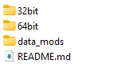
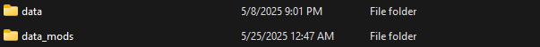
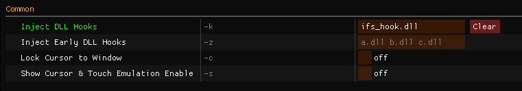
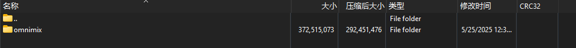
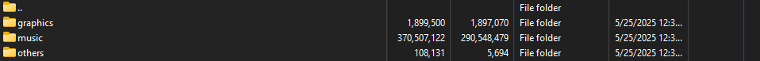
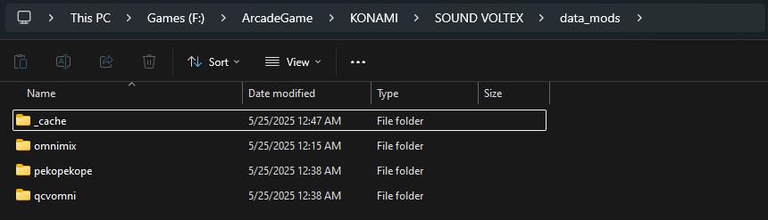

# 安装Mod/omnimix

## 安装前置

!!! info ""

    安装Mod需要提前安装一个前置叫ifs_layeredfs，你可以从[mon/ifs_layeredfs](https://github.com/mon/ifs_layeredfs/releases)下载，或者用我预下载的

    [ifs_layeredfs_3.6.zip](../../public/ifs_layeredfs_3.6.zip)

    打开压缩包，里面如图

    

    将`data_mods`解压到游戏的目录，跟`data`平级

    

    再将`64bit`里的`ifs_hook.dll`解压到游戏目录的`modules`文件夹里

    

## 启用前置

!!! info ""

    打开spicecfg，来到`Options`，在`Inject DLL Hooks`里填入：`ifs_hook.dll`

    

## 安装Mod

!!! info ""

    以omnimix为例，打开压缩包，第一层应该是Mod名的文件夹，再点开一层以后是一堆覆盖用的数据

    

    

    将第一层的文件夹解压到游戏目录的`data_mods`文件夹里即可完成安装

    

!!! tips "提示"

    如果你点开以后直接就是图2，请自行创建一个文件夹用来包装这些数据，名称随意

!!! warning "注意"

    你的数据被游戏加载过一次后就会创建`_cache`文件夹，更新游戏时一定要删除这个文件夹重建缓存，否则歌曲类的Mod将会和更新包冲突导致不显示新歌