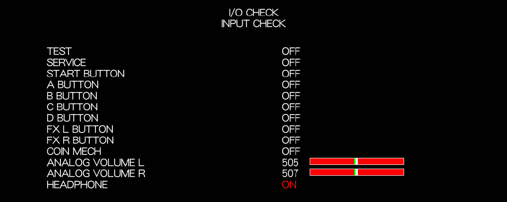
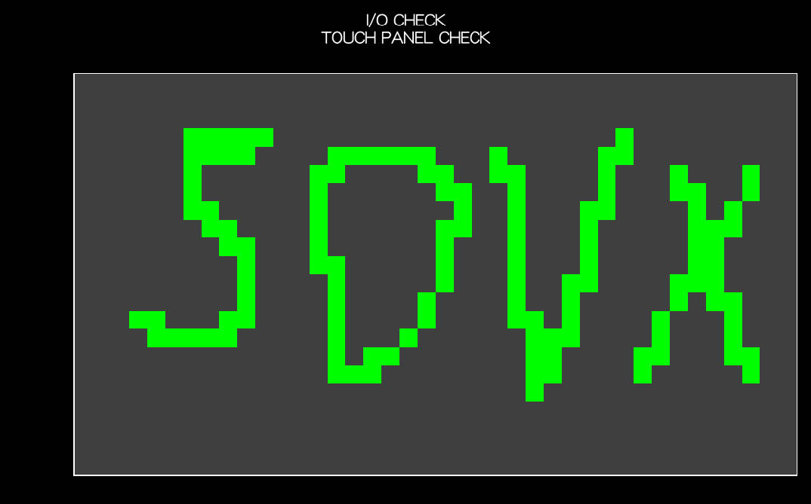
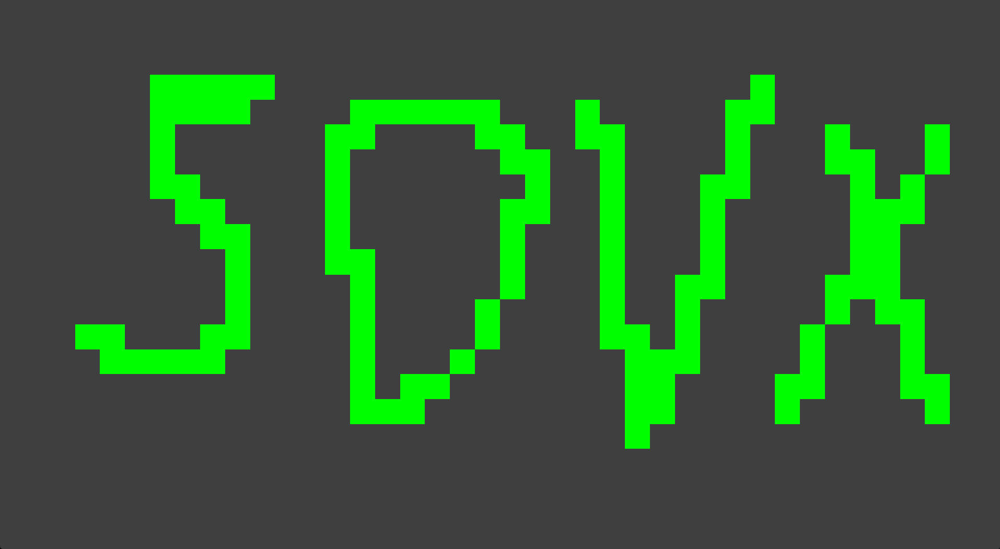
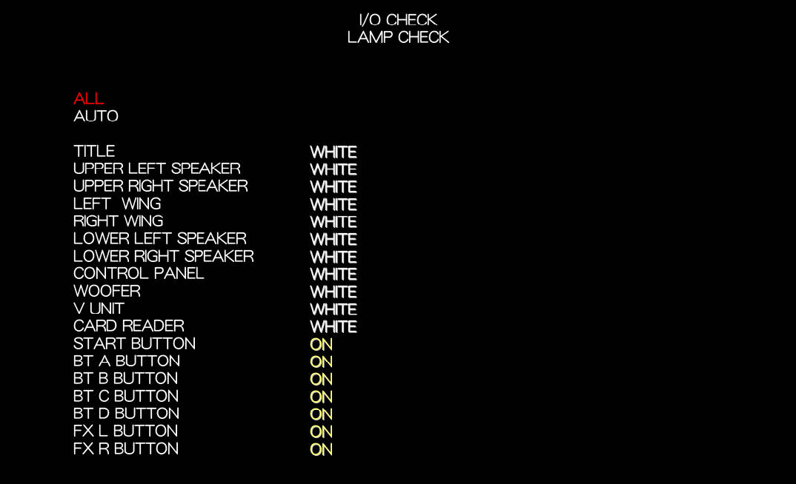
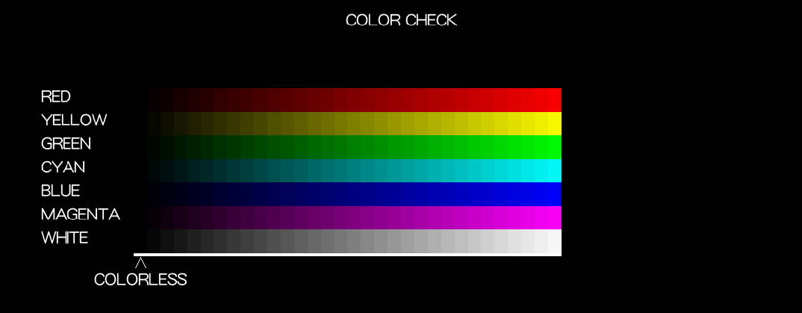
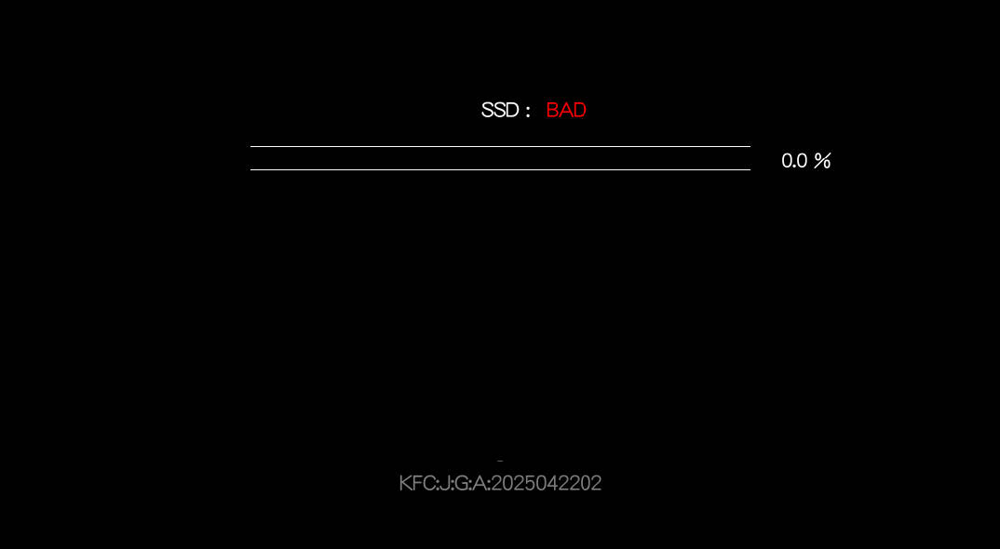
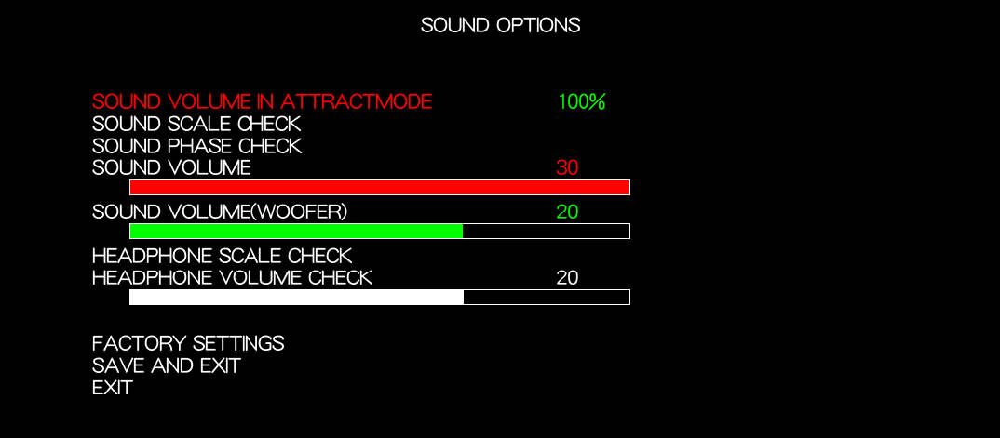

# 测试菜单

## I/O CHECK

IO检查菜单里用于检查IO的配置是否异常

=== "INPUT CHECK"

    检查输入按钮是否异常

    

=== "TOUCH PANEL CHECK"

    检查触摸屏是否异常

    

    

=== "CAMERA CHECK"

    检查摄像头是否异常

    

=== "LAMP CHECK"

    检查灯光是否异常

    

=== "MECHANISM CHECK"

    检查投币口是否异常

    

=== "SWITCH COUNTER CHECK"

    检查按钮开关计数器

    

=== "CALIBRATION SETTINGS"

    旋钮矫正设置

    

## SCREEN CHECK

检查屏幕是否异常

## COLOR CHECK

检查显示色彩是否异常

## ROM CHECK

游戏完整性检查？Spice模拟无法使用这个模块，存疑

## IC CARD CHECK

读卡器检测，放置卡片即可测试

## SOUND OPTIONS

音频设置

- SOUND VOLUME IN ATTRACTMODE：调整Atrract模式（未刷卡的那个待机主菜单）的音量、
- SOUND SCALE CHECK：音频音阶测试
- SOUND PHASE CHECK：音频相位测试
- SOUND VOLUME：音频音量
- SOUND VOLUME（WOOFER）：低音炮音频音量
- HEADPHONE SCALE CHECK：耳机孔音阶测试
- HEADPHONE VOLUME CHECK：耳机孔音量测试

## GAME OPTIONS

游戏设定

- SHOP CLOSE SETTING：闭店设定
- CONTINUATION：续关设定