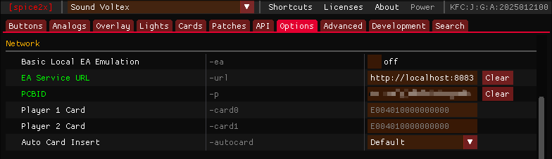

# 配置Asphyxia

Asphyxia，又称氧无，是最流行的BEMANI系街机使用的本地EA服务器，你可以根据下面的说明配置/启用对应的功能至游戏

## 安装氧无

!!! info ""

    [asphyxia core](https://github.com/asphyxia-core/asphyxia-core.github.io/releases){ .md-button .md-button--primary }

    从上方下载氧无核心，你应该选择`asphyxia-core-win-x64.zip`进行下载
    
    下载完成并解压出来，最终应该如下图，请将其放置在游戏本体文件夹的旁边而不是跟游戏本体放在一起方便后期维护

    

    

## 安装插件

!!! info ""

    氧无本身只是一个核心，其没有对任何一个游戏做官方的支持以规避风险。如果需要启用对某一游戏的支持，你需要寻找由社区维护的插件并安装，以下是目前还在维护的SDVX插件的下载地址

    [22vv0/asphyxia_plugins](https://github.com/22vv0/asphyxia_plugins/releases){ .md-button .md-button--primary }

    !!! warning 
        
        插件自6.1.0版本起仅支持6代（Exceed Gear），不再支持1代到5代

    下载完成后打开氧无程序目录，进入`plugins`文件夹，新建文件夹`sdvx@asphyxia`

    

    将刚才下载的插件的文件全部解压缩至这个文件夹，注意不要有嵌套

    

    ??? warning "错误示范"

        打开后还有一个文件夹就叫嵌套

        

## 初始化氧无

!!! info ""

    完成后双击`asphyxia-core-x64.exe`启动，此时应该会自动弹出网页，这个就是氧无的后台，如果没有请**手动打开浏览器，访问`localhost:8083`**

    

## 基础设定

!!! info ""

    你可以在Dashbord页面配置氧无的基础设定

    

    | 功能 | 说明 |
    | --- | --- |
    | `Port` | 氧无所使用的端口 | 
    | `Bind` | 氧无所绑定的域名 |
    | `Ping IP` | 服务器连通性检测IP，如果失败则离线 |
    | `Matching port` |  |
    | `Allow register` | 是否允许注册 |
    | `Maintenance mode` | 是否启用服务器维护 |
    | `Enable paseli` | 是否启用Paseli，关闭后无法选择NORMAL,FRIEND,SKILL ANALYZER以外的模式 | 
    | `WebUI on startup` | 是否每次启动时都打开后台 |

!!! info ""

    `http://绑定域名:端口号`就是Spice里需要填的`EA Service URL`

    

## 配置SDVX

点击左侧的SDVX即可展开

!!! info ""

    ### Overview

    

    | 功能 | 说明 |
    | --- | --- |
    | `Exceed Gear Data Derectory` | 设定游戏本体的路径，用于复制相关资源 | 
    | `Ranked Match Season` | 选择ARENA/SINGLE BATTLE排名赛季，一般不需要更改 |
    | `Use Blaster Pass` | 启用Blaster Pass |
    | `Unlock All Valkyrie and Premium Items` | 全解所有控制台/副屏幕背景/系统背景等内容 |
    | `Unlock All Songs` | 歌曲全解 |
    | `Unlock All Navigators` | 领航员全解 |
    | `Unlock All Appeal Cards` | Appeal Cards全解 | 

!!! info ""

    ### Profiles

    此处存放用户数据，每读一张新卡就会创建一个用户，可以从这里修改副屏幕背景，游戏主题等数据

    !!! warning 

        修改前需要在[Update Webui Assets](#update-webui-assets)里更新资源，否则此处不会显示任何图片与音频

    你可以找到你对应的数据，点击Detail进入编辑页面

    

    | 功能 | 说明 |
    | --- | --- |
    | `Detail` | 基本信息 | 
    | `Customization` | 个性化，可以更改游戏主题，副屏幕背景，表情等等 |
    | `Score` | 成绩 |
    | `Skill Analyzer` | 考段记录 |
    | `Achievements` | 成就 |
    | `Rivals` | 设定竞争对手（本地服没啥用，就你一个人） |
    | `Valkyrie Generator` | 抽卡（老东西），开启全解后无法使用 | 
    | `Premium Generator` | 抽卡（新东西），开启全解后无法使用 | 

!!! info ""

    ### Startup Flags

    此处是一些服务端下发给游戏的参数，根据需要更改，否则保持默认

    更改后请点击右下角的`Apply`应用

    | 功能 | 说明 |
    | --- | --- |
    | `USE_CUDA_VIDEO_PRESENTER` | 启用CUDA渲染 | 
    | `HISCORE_DATA_LIMIT` | 最高成绩数据限制（？存疑） |
    | `Sub monitor V-Sync` | 启用副屏幕垂直同步 |
    | `DEMOLOOP_INFORMATION` |  |
    | `Konami 50th Anniversary logo` | 启用开屏的KONAMI 50周年的LOGO |
    | `Christmas login greeting` | 启用领航员的圣诞特殊问候 |
    | `Valentines Day login greeting` | 启用领航员的情人节特殊问候 | 
    | `White Day login greeting` | 启用领航员的白色情人节特殊问候 | 
    | `Halloween login greeting` | 启用领航员的万圣节特殊问候 | 
    | `V-RAN (april fools 2024)` | 启用2024年愚人节特效（在歌曲搜索栏输入"V-RAN"） | 
    | `ゆっくりしていってね！！！` | 启用2025年愚人节特效 | 

!!! info ""

    ### Unlock Events

    #### 解锁事件Unlock Events

    | 功能 | 说明 |
    | --- | --- |
    | `TAMA猫アドベンチャー (TAMANEKO Adventure)` | 启用TAMA猫跑图 | 
    | `VARIANT GATE` | Accumulate VARIANT POWER to make a special song folder appear in EXTRACK, clear the songs at a certain difficulty to obtain keys. Get all keys to play OVER TRACK. |

    #### 集章事件Stamp Events

    | 说明 |
    | --- | 
    | 解锁一些歌曲与Appeal Card，开启全解则已经解锁，且大部分已经可以直接获得，无需设定 |

    #### 礼物事件Gift Events
    
    | 说明 |
    | --- | 
    | 解锁一些歌曲与Appeal Card，开启全解则已经解锁，无需设定 |

    #### 联动事件Cross Events
    
    | 说明 |
    | --- | 
    | 解锁联动曲，开启全解则已经解锁，无需设定 |

!!! info ""

    ### Update Webui Assets

    如果你已经设定过游戏路径，并且安装过ffmpeg，此处直接点击Update即可完成资源复制，会占用2-3GB的空间

    ??? tips "如何安装ffmpeg"

        _**仅较新的Win10，Win11系统支持此方法**_

        打开终端，输入

        `winget install ffmpeg`

        之后重启电脑即可

        

    

    之后你还需要打开插件目录，双击`bgm_convert.bat`转换音频格式，否则音频无法播放

    

