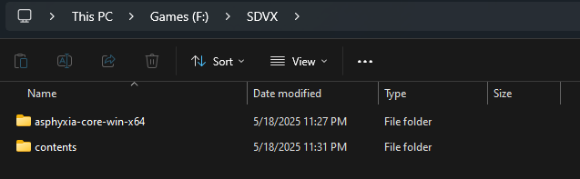
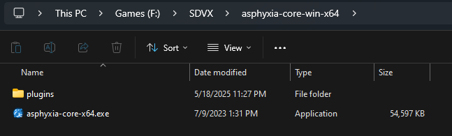
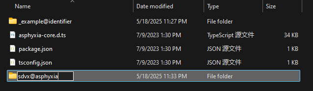
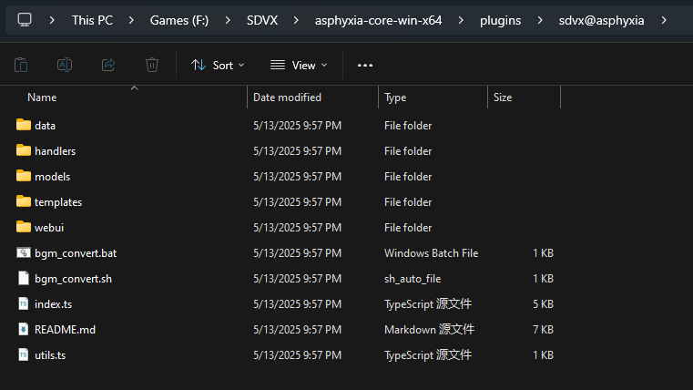
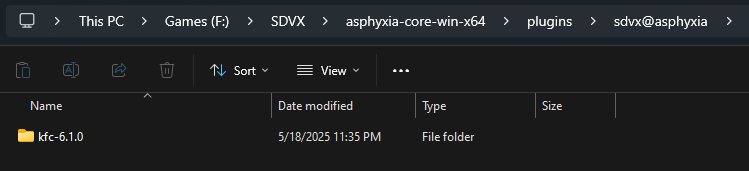
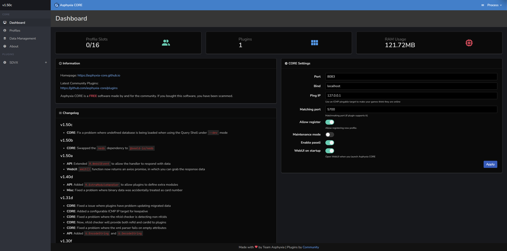
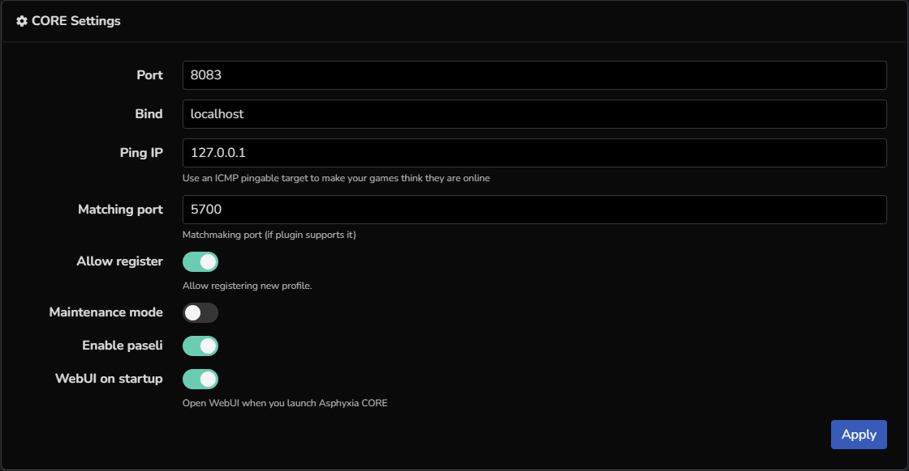
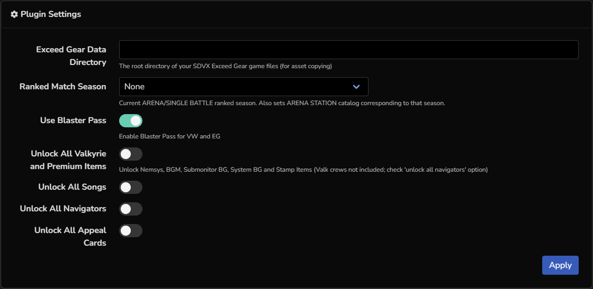

# 配置Asphyxia

Asphyxia，又称氧无，是最流行的BEMANI系街机使用的本地EA服务器，你可以根据下面的说明配置/启用对应的功能至游戏

## 安装氧无

!!! info ""

    [asphyxia core](https://github.com/asphyxia-core/asphyxia-core.github.io/releases){ .md-button .md-button--primary }

    从上方下载氧无核心，你应该选择`asphyxia-core-win-x64.zip`进行下载
    
    下载完成并解压出来，最终应该如下图，请将其放置在游戏本体文件夹的旁边而不是跟游戏本体放在一起方便后期维护

    

    

## 安装插件

!!! info ""

    氧无本身只是一个核心，其没有对任何一个游戏做官方的支持以规避风险。如果需要启用对某一游戏的支持，你需要寻找由社区维护的插件并安装，以下是目前还在维护的SDVX插件的下载地址

    [22vv0/asphyxia_plugins](https://github.com/22vv0/asphyxia_plugins/releases){ .md-button .md-button--primary }

    !!! warning 
        
        插件自6.1.0版本起仅支持6代（Exceed Gear），不再支持1代到5代

    下载完成后打开氧无程序目录，进入`plugins`文件夹，新建文件夹`sdvx@asphyxia`

    

    将刚才下载的插件的文件全部解压缩至这个文件夹，注意不要有嵌套

    

    ??? warning "错误示范"

        打开后还有一个文件夹就叫嵌套

        

## 初始化氧无

!!! info ""

    完成后双击`asphyxia-core-x64.exe`启动，此时应该会自动弹出网页，这个就是氧无的后台，如果没有请**手动打开浏览器，访问`localhost:8083`**

    

## 基础设定

!!! info ""

    你可以在Dashbord页面配置氧无的基础设定

    

    | 功能 | 说明 |
    | --- | --- |
    | `Port` | 氧无所使用的端口 | 
    | `Bind` | 氧无所绑定的域名 |
    | `Ping IP` | 服务器连通性检测IP，如果失败则离线 |
    | `Matching port` |  |
    | `Allow register` | 是否允许注册 |
    | `Maintenance mode` | 是否启用服务器维护 |
    | `Enable paseli` | 是否启用Paseli，关闭后无法选择NORMAL,FRIEND,SKILL ANALYZER以外的模式 | 
    | `WebUI on startup` | 是否每次启动时都打开后台 |

## 配置插件

!!! info ""

    

    | 功能 | 说明 |
    | --- | --- |
    | `Exceed Gear Data Derectory` | 设定游戏本体的路径，用于复制相关资源 | 
    | `Ranked Match Season` | 选择ARENA/SINGLE BATTLE排名赛季，一般不需要更改 |
    | `Use Blaster Pass` | 启用Blaster Pass |
    | `Unlock All Valkyrie and Premium Items` | 全解所有控制台/副屏幕背景/系统背景等内容 |
    | `Unlock All Songs` | 歌曲全解 |
    | `Unlock All Navigators` | 领航员全解 |
    | `Unlock All Appeal Cards` | Appeal Cards全解 | 