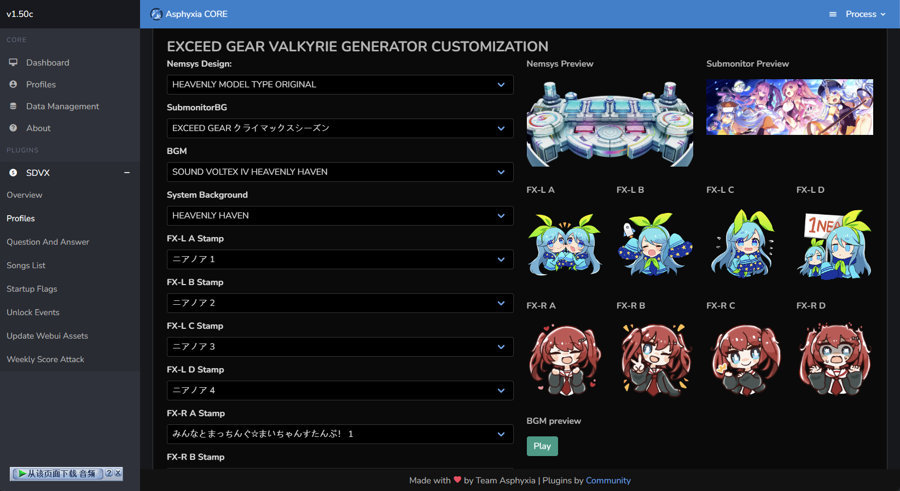
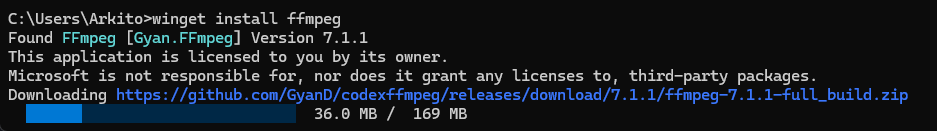
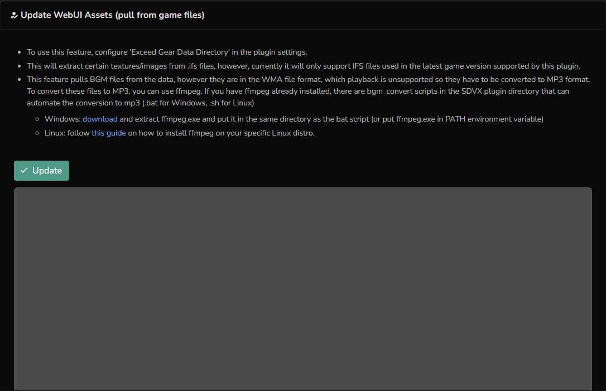
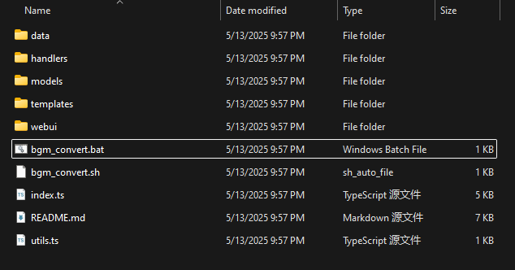

# 进阶Asphyxia配置

## 配置SDVX

点击左侧的SDVX即可展开

!!! info ""

    ### Overview

    

    | 功能 | 说明 |
    | --- | --- |
    | `Exceed Gear Data Derectory` | 设定游戏本体的路径，用于复制相关资源 | 
    | `Ranked Match Season` | 选择ARENA/SINGLE BATTLE排名赛季，一般不需要更改 |
    | `Use Blaster Pass` | 启用Blaster Pass |
    | `Unlock All Valkyrie and Premium Items` | 全解所有控制台/副屏幕背景/系统背景等内容 |
    | `Unlock All Songs` | 歌曲全解 |
    | `Unlock All Navigators` | 领航员全解 |
    | `Unlock All Appeal Cards` | Appeal Cards全解 | 

!!! info ""

    ### Profiles

    此处存放用户数据，每读一张新卡就会创建一个用户，可以从这里修改副屏幕背景，游戏主题等数据

    !!! warning 

        修改前需要在[Update Webui Assets](#update-webui-assets)里更新资源，否则此处不会显示任何图片与音频

    你可以找到你对应的数据，点击Detail进入编辑页面

    

    | 功能 | 说明 |
    | --- | --- |
    | `Detail` | 基本信息 | 
    | `Customization` | 个性化，可以更改游戏主题，副屏幕背景，表情等等 |
    | `Score` | 成绩 |
    | `Skill Analyzer` | 考段记录 |
    | `Achievements` | 成就 |
    | `Rivals` | 设定竞争对手（本地服没啥用，就你一个人） |
    | `Valkyrie Generator` | 抽卡（老东西），开启全解后无法使用 | 
    | `Premium Generator` | 抽卡（新东西），开启全解后无法使用 | 

!!! info ""

    ### Startup Flags

    此处是一些服务端下发给游戏的参数，根据需要更改，否则保持默认

    更改后请点击右下角的`Apply`应用

    | 功能 | 说明 |
    | --- | --- |
    | `USE_CUDA_VIDEO_PRESENTER` | 启用CUDA渲染 | 
    | `HISCORE_DATA_LIMIT` | 最高成绩数据限制（？存疑） |
    | `Sub monitor V-Sync` | 启用副屏幕垂直同步 |
    | `DEMOLOOP_INFORMATION` |  |
    | `Konami 50th Anniversary logo` | 启用开屏的KONAMI 50周年的LOGO |
    | `Christmas login greeting` | 启用领航员的圣诞特殊问候 |
    | `Valentines Day login greeting` | 启用领航员的情人节特殊问候 | 
    | `White Day login greeting` | 启用领航员的白色情人节特殊问候 | 
    | `Halloween login greeting` | 启用领航员的万圣节特殊问候 | 
    | `V-RAN (april fools 2024)` | 启用2024年愚人节特效（在歌曲搜索栏输入"V-RAN"） | 
    | `ゆっくりしていってね！！！` | 启用2025年愚人节特效 | 

!!! info ""

    ### Unlock Events

    #### 解锁事件Unlock Events

    | 功能 | 说明 |
    | --- | --- |
    | `TAMA猫アドベンチャー (TAMANEKO Adventure)` | 启用TAMA猫跑图 | 
    | `VARIANT GATE` | Accumulate VARIANT POWER to make a special song folder appear in EXTRACK, clear the songs at a certain difficulty to obtain keys. Get all keys to play OVER TRACK. |

    #### 集章事件Stamp Events

    | 说明 |
    | --- | 
    | 解锁一些歌曲与Appeal Card，开启全解则已经解锁，且大部分已经可以直接获得，无需设定 |

    #### 礼物事件Gift Events
    
    | 说明 |
    | --- | 
    | 解锁一些歌曲与Appeal Card，开启全解则已经解锁，无需设定 |

    #### 联动事件Cross Events
    
    | 说明 |
    | --- | 
    | 解锁联动曲，开启全解则已经解锁，无需设定 |

!!! info ""

    ### Update Webui Assets

    如果你已经设定过游戏路径，并且安装过ffmpeg，此处直接点击Update即可完成资源复制，会占用2-3GB的空间

    ??? tips "如何安装ffmpeg"

        _**仅较新的Win10，Win11系统支持此方法**_

        打开终端，输入

        `winget install ffmpeg`

        之后重启电脑即可

        

    

    之后你还需要打开插件目录，双击`bgm_convert.bat`转换音频格式，否则音频无法播放

    
