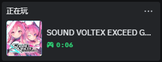

# Discord Rich Presence与自定义
Discord用户最不陌生的就是Rich Presnece了，我恨不得让所有人每秒都知道我在什么，所以我相当喜欢这个功能。当然Spice也是内置了RPC的，可以直接使用，但是默认不区分游戏版本，以及自带图标比较丑，所以Spice也内置了RPC AppID Override， 你可以在Discord Devoloper Portal来创建

## 启用Discord RPC

!!! info ""
 
    打开Spicecfg，在`Advance`选项卡里启用Discord Rich Precence，在游戏启动后即可看到RPC了

    

    

## 更改RPC图标与名称

!!! info ""

    [Discord Developer Portal](https://discord.com/developers/applications){ .md-button .md-button--primary }

    点击访问Discord开发者平台，登录你的账号，创建一个新的Application。这里输入的Application Name就是RPC显示出来的名称，取游戏名或者随便怎么来都可以

    

    创建完成进入Setting以后，我们就可以添加Icon了，我这里是使用的从家用版游戏ico提取出来的，这里做存档。添加完成后要点下方的Save Changes才算完成

    

    

    然后点上图的Application ID下面的Copy，来到Spice的`Development` 选项卡，将ID粘贴到`Discord RPC AppID Override`即可

    

    效果图

    