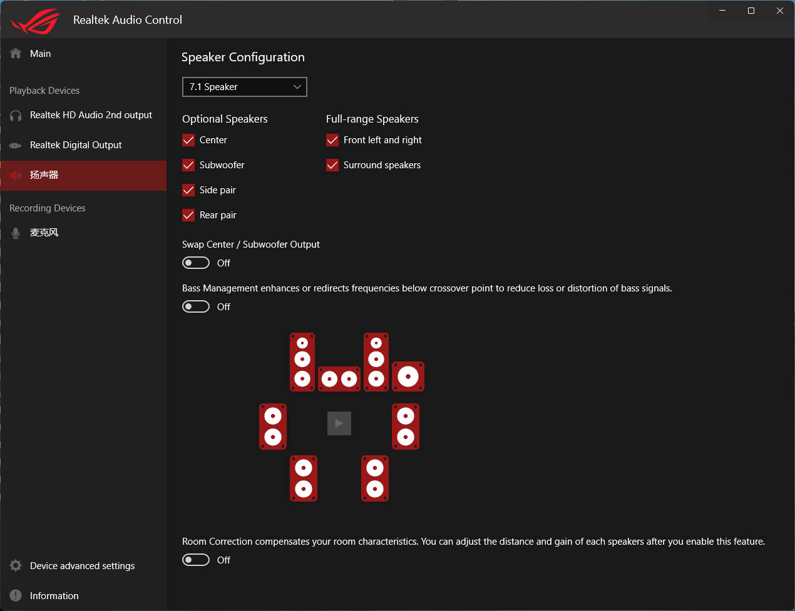
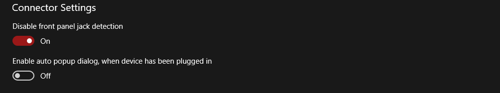
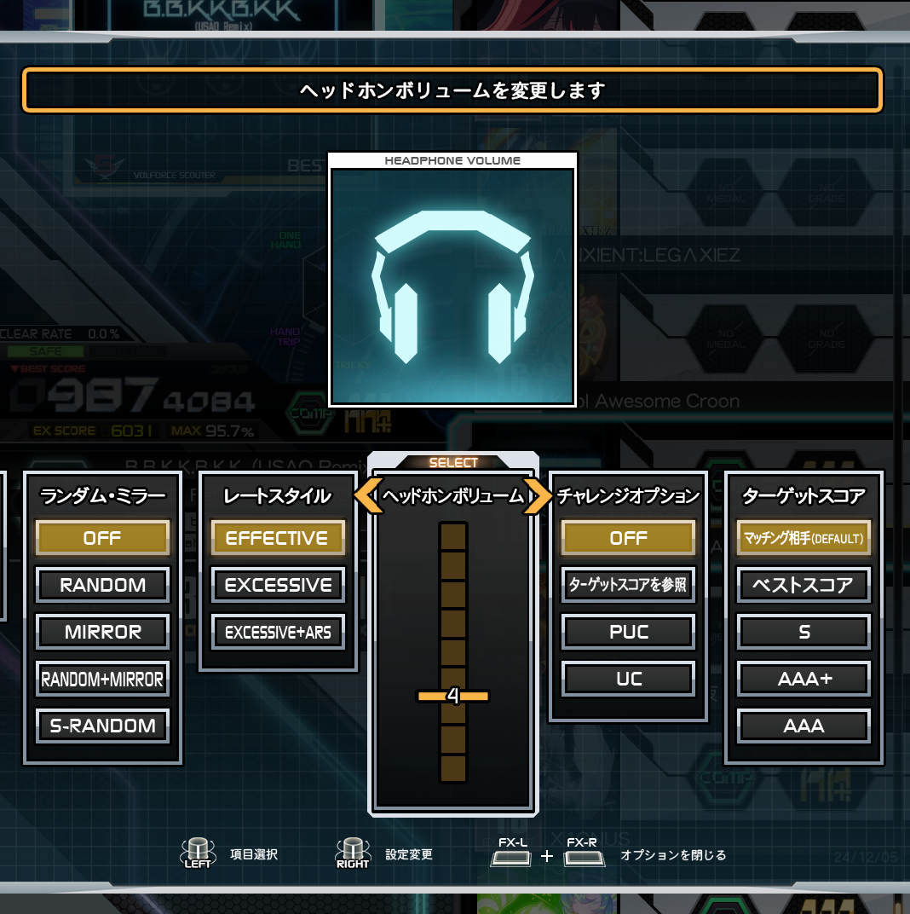
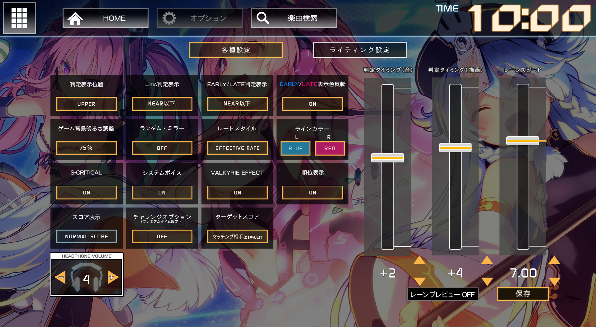

# 耳机孔配置

## 启用多声道输出
!!! info ""

    此项需要你的声卡支持，太低端的板子或者笔记本可能不支持
    
    以我的主板板载的Realtek ALC1220，进入声卡控制面板，选择7.1喇叭或者5.1喇叭即可开启，官机使用7.1

    

## 关闭Shared WASAPI

!!! info ""

    打开spicecfg，将Shared WASAPI补丁关闭，此时游戏会启用Exclusive WASAPI

    

    !!! note
        此时将仅有游戏可输出声音，其他软件无法捕获声卡

## 启用耳机孔

!!! info ""

    耳机孔带有插入检测，默认是关闭的，有两种方法开启

    ??? tips "方法一：补丁"

        

    ??? tips "方法二：插孔检测"

        在Buttons选项卡里，找到Headphone，Edit，点击`Invert`即可使游戏认为耳机口插着耳机

        

    !!! warning  

        请不要将两者同时使用

## 插入耳机

!!! info ""

    耳机口是主板上的***REAR后置声道输出***，一般是**黑色**的，游戏会从这里输出耳机孔的内容，其余的会从你的主音频设备输出。近年来新主板逐渐取消了下面三排，需要注意你的主板是否有后置声道输出的口

    *图源网络

    

    ??? tips "没有声音？"

        如果你的耳机插在机箱前面板上请插到后面板上，声卡在插入前面板的同时默认会屏蔽后面板的输出。
        
        如果你的声卡支持，以Realtek为例，你可以直接在控制面板里禁用前面板

        

        或者将前后面板的混流拆分，各自输出（推荐）

        

## 调整音量

!!! info "" 

    耳机孔默认音量为1，进入选曲界面后按小键盘的`7`与`1`可以增大或减小音量，之后随数据保存。你也可以按`FX-L`和`FX-R`，拉到倒数第二列，调整耳机音量

    

    女武神框体也可以在副屏幕上调整

    

    声音太轻你就开满别怕，这个口推不动耳机，大部分都会很轻，官机上都会加放大器

    同时系统音量也会影响耳机孔的音量