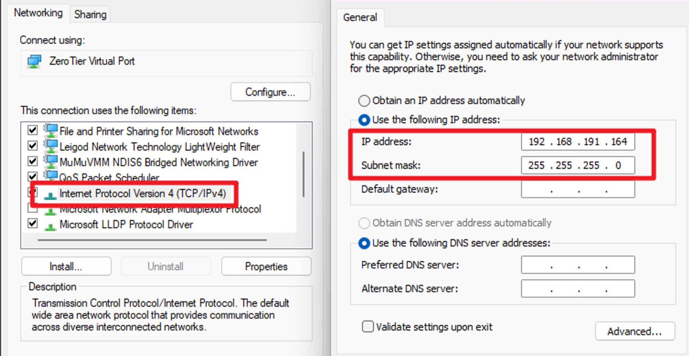

# 店内联机（局域网）

!!! warning

    在进行联机前需要检查双方HDD以下内容

    - `modules/soundvoltex.dll` 一致
        - 可以打开cfg在Paches里的KFC一栏旁边的问号查看dll版本
        - Patch不影响
        - 懒人包可能把 `soundvoltex.dll` 放在了游戏根目录而不是在`modules`里，优先级要比放在    `modules` 里高
            - 如果使用懒人包但是用了更新包，需要覆盖完更新包以后将`modules` 文件夹里的  `soundvoltex.dll` 挪到根目录，否则将还是老版本
    - `prop/ea3-config.xml` soft一栏的版本日期一致

    ```xml
        <soft>
            <model __type="str">KFC</model>
            <dest __type="str">J</dest>
            <spec __type="str">G</spec>
            <rev __type="str">A</rev>
            <ext __type="str">2024072300</ext>
        </soft>
    ```

    双方以上任意一个不一致都会导致店内匹配找不到人


## 方法一：Radmin VPN

### 安装Radmin

!!! info ""

    打开官网

    [RadminVPN](https://www.radmin-vpn.com/){ .md-button .md-button--primary }

    下载并安装，然后打开程序等待初始化完成，点亮开关

    

### 创建房间or加入房间

!!! info ""

    在网络里选择加入或者创建，联机双方都需要***进入同一个房间***，具体按照提示操作即可，操作完成后等待网络显示为在线即可

    

    

    

### 配置Spice

!!! info ""
    打开spicecfg，来到Development，在`Prefered NetAdapter IP`填入Radmin的局域网IP，`Prefered NetAdapter Subnet`填入子网掩码`255.0.0.0` 

    

### 最终检查

!!! info ""

    启动游戏，进入TEST，选择Network Options - Network Check，确保IP Address、Subnet Mask与刚才再Spice里填写的一致即可

    

    同时确保双方Network Options里的Cabinet Group ID相同

    

!!! note
    ✅ 到此完成店内联机的配置，启动游戏折磨好友吧

---

## 方法二：Zerotier

!!! warning

    不建议用，Radmin要稳定的多，同地区可以走P2P，延迟非常低

### 安装Zerotier

!!! info ""

    [Zerotier](https://www.zerotier.com/){ .md-button .md-button--primary }

    从官网下载主程序并安装，完成后打开，软件会在托盘里挂着

    

### 配置Zerotier

!!! info ""

    在官网注册账号

    登录账号进入后台，选择`Create A Network`创建一个局域网，点击进入编辑页

    

    首先拖到下面找到`Settings`，更改局域网的名称，随便什么方便识别就行，然后将`Access Control`改成`Public`

    

    再往下拖把`IPv4 Auto Assign`这一栏，改成`192.168`开头的任意一项，当然不更改也OK

    

    回到网页最上面，复制局域网名字旁边的`Network ID`

    

!!! warning
    改成Public以后任何人获取了你的Network ID就可以直接加入，这里只是嫌麻烦不想每次都同意一遍才改的，如果会使用Private模式请尽量保持Private

### 加入局域网

!!! info ""

    右键托盘里的软件，选择`Join New Network`，然后粘贴刚才复制的`Network ID`并确定

    

    

    检查软件是否出现局域网，`Status`是不是`OK`，没问题那就已经加入成功了

    

### 配置Spice

!!! info ""

    打开spicecfg，来到`Development`，在`Prefered NetAdapter IP`填入Zerotier的局域网IP，`Prefered NetAdapter Subnet`填入子网掩码`255.255.255.0` 即`'IP'/24`


    

    你可以右键右下角网络图标，选择“网络与Internet设定”，然后点击高级网络设置，找到名叫Zerotier One的适配器并点击，选择更多适配器选项，双击`Internet协议v4`，第一行对应`Prefered NetAdapter IP`，第二行对应`Prefered NetAdapter Subnet`

    

    

### 最终检查

!!! info ""

    启动游戏，进入TEST，选择Network Options - Network Check，确保IP Address、Subnet Mask与刚才再Spice里填写的一致即可

    同时确保双方Network Options里的Cabinet Group ID相同

    

    

!!! note
    ✅ 到此完成店内联机的配置

> Reference article from: konamisb,Arr0w66  
> 关键词：联机 店内联机 局域网