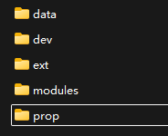

# 常见问题

## 文件目录

!!! info ""

    一个纯净的游戏文件将仅包含下面两种情况，其余的所有文件都是外部文件

    

    

    其中`dev` 的存在与否决定游戏是否保留设置，删除此文件夹将清空`nvram` 使游戏恢复出厂设置，首次进入强制执行旋钮矫正

    如果下载到的文件是这样的

    

    我非常建议创建一个`modules`文件夹并将所有`.dll` 文件全部放到里面，之后所有额外新增的`.dll` 例如`ifs_hook.dll` 也都放到里面。这样可以使文件目录清晰可维护，同时不会影响覆盖更新包，因为更新包里都是遵循上述逻辑，如果不这么做，每次都需要将`modules`里的文件手动挪到根目录去，不然主入口文件`soundvoltex.dll` 以及其他例如`avs2` 音视频编解码库将不会得到更新，可能会导致贴图错误，游戏崩溃等各种问题。放弃优先性保证兼容性

## Patch导入失败

!!! info ""

    众所周知，只要你身处中国大陆部分地区并且不使用魔法，Patch大概率会导入不了，因为连接不上Github，抛错`WinHttpSendRequest failed:12030` 

    解决也很简单，换成CDN地址就可以了，但是可能会有资源同步延迟，不过一般也不会经常更新Patch，不是很影响

    将 `https://sp2x.two-torial.xyz` 换成：`https://cdn.jsdelivr.net/gh/two-torial/sp2xpatcher/patches/`

## Mod/omnimix无法加载

!!! info ""

    **Spice2x** 2024-12-06的一次更新，内置的LayeredFS被移除了，现在均需要自行安装，请从[mon/ifs_layeredfs](https://github.com/mon/ifs_layeredfs/releases)下载，或者用我预下载的

    [ifs_layeredfs_3.6.zip](../../public/ifs_layeredfs_3.6.zip)

    打开压缩包，将`data_mods`放到游戏目录，跟`data`同级

    

    然后将压缩包64bit文件夹里的`ifs_hook.dll` 放到`modules`文件夹里，打开spicecfg，在Options-Inject Dll Hooks，填入`ifs_hook.dll`即可完成前置安装