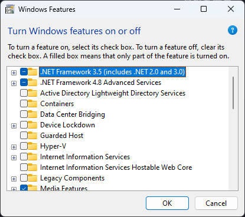
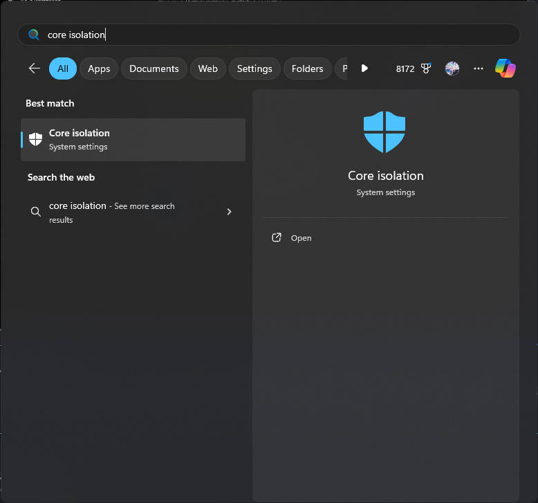
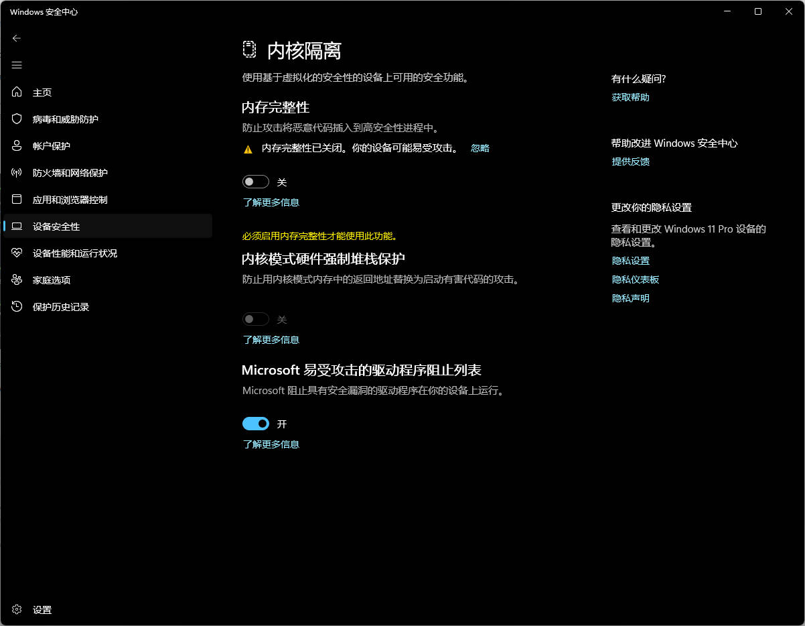
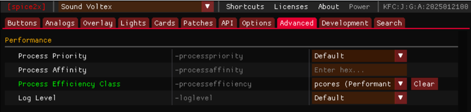
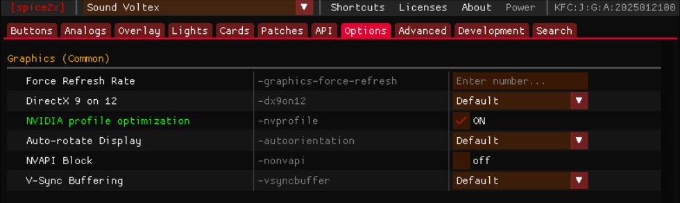
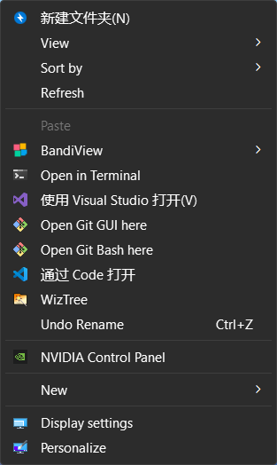
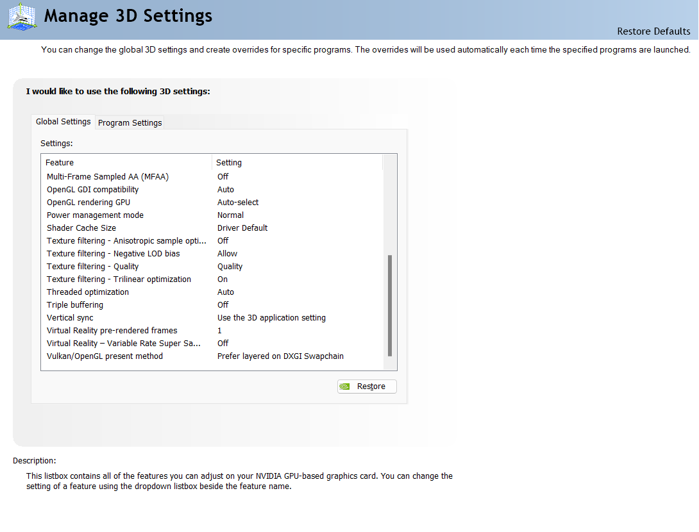
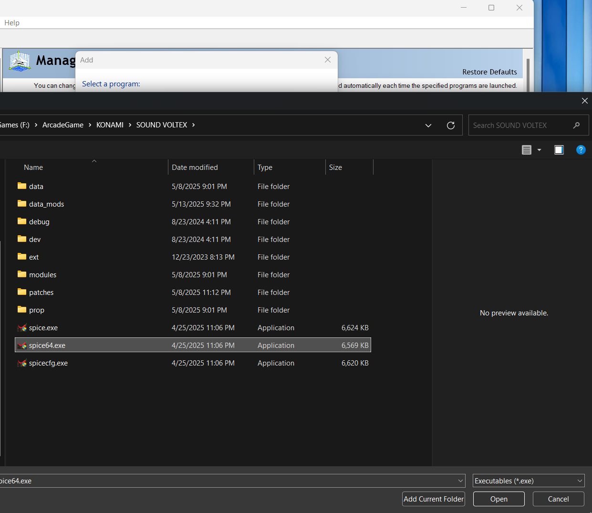
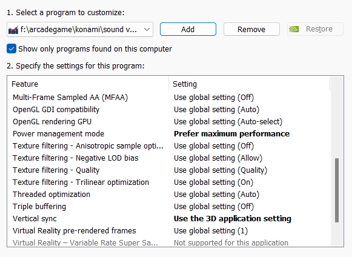

# 优化运行性能

!!! quote "说明"

    许多资料整合并简化自spice2x官方手册

## 硬件配置

!!! info ""

    - 请确保你的硬件已经达标

    - 许多时候你只需要确保你使用的是NVIDIA显卡以及不差的处理器以及8G以上内存就可以获得120帧的体验，这个游戏并不吃配置，甚至Live2D的压力都在CPU而不是显卡

    - 2021款 6代女武神官机的大致配置如下：

        | 硬件 | 型号 |
        | ---- | ---- | 
        | CPU | i5-9400F |
        | 内存 | DDR4-2133 8G |
        | 显卡 | NVIDIA Geforce GTX 1650 4GB |
        | 声卡 | ASUS Xonar AE + KONAMI 前端放大器 | 
        | 硬盘 | SATA SSD 256GB | 

    

## 系统优化

!!! info ""

    - 禁用`Hyper-V`、`虚拟机管理平台`、`VBS (Virtualization-Based Security)`

        ??? tips "操作方法"

            按`Win+R`，输入optionalfeatures，将`Hyper-V`、`虚拟机平台`禁用

            

            打开开始菜单，搜索`内核隔离`，关闭内存完整性

            

            

    - 禁用全屏优化

        - 右键单击​`spice64.exe`，选择“属性”，“兼容性”选项卡，更改所有用户的设置，然后勾选`禁用全屏优化Disable fullscreen optimizations`

    - 如果你是11代英特尔及以上的处理器，你可以在Spice里，选择`Advanced`选项卡往下拉，找到`Process Efficient Class`，选择`pcores`，限制游戏运行在P核（又称性能核，大核）上

        

## 电源管理

!!! info ""

    - 确保你的电源选项选择为`高性能`

!!! warning

    启用高性能将时刻保持你的CPU为最高睿频状态，但也可以使你的帧生成更加稳定。13/14代 i7以上会缩肛的用户，对电费敏感的同学，以及使用笔记本的同学酌情开启

!!! tips

    如果你游戏帧率不正常（例如只能跑到50帧，90帧，跳帧很严重），并且也启用了高性能模式，大概率是电源选项隐藏属性被篡改（例如运行过早期版本的三角洲行动被修改了隐藏电源选项锁定了CPU频率）

    请以管理员身份运行`PowerShell`或者`命令提示符`，执行以下命令重置电源选项，并重启电脑，重启完成后会清除除平衡外所有的电源模式并重置为初始值，你可以自行添加高性能回来

    ```bash
    powercfg -restoredefaultschemes
    ```

    !!! warning 

        笔记本用户请酌情运行，他会将你厂商自带的电源选项全部清空

## NVIDIA控制面板设置

!!! info ""

    N卡用户可以在Spicecfg里打开`NVIDIA profile optimization`来自动添加部分图形优化项，但同时也建议你根据下方的手动配置方法检查一遍是否生效

    

    ??? info "手动配置"

        在桌面右键，选择NVIDIA控制面板，打开

        

        在`管理3D设置`菜单中，将全局设定中垂直同步的选项改成`使用3D应用程序设置`，如果有的情况下请禁用掉你显示器的G-SYNC，FreeSync等功能

        !!! warning 

             **请勿**在全局设定中将垂直同步设置为关或者开，将会导致游戏帧率无限高或者锁60帧（包括女武神模式）

        

        然后在程序设定中，点击添加，浏览，添加游戏目录里的`spice64.exe`程序

        

        将电源管理模式改成`最高性能优先`，垂直同步为`使用3D应用程序设置`

        