# 部署

!!! warning

    - 本文不会使用懒人包，将通过纯净包讲解

    - 进行部署前请确保你的文件来源纯净，因为下载到脏文件导致的各种问题，以及携带病毒请自行解决

## 检查文件结构

!!! info ""

    一个干净完整的文件结构应该如下

    ```
    PATH: content
    ├─data  # 游戏数据
    ├─ext   # 外部硬件数据，应该是打印机的
    ├─modules   # 游戏依赖与主进程
    └─prop  # 游戏属性

    ```
    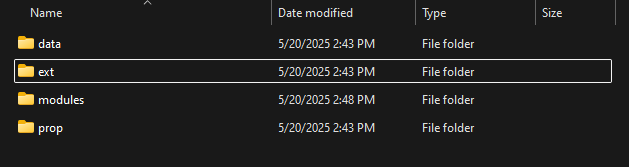

??? tips "我有一堆DLL文件且没有`modules`文件夹"

    请新建一个文件夹并将所有`.dll`文件全部剪切到`modules`文件夹内

    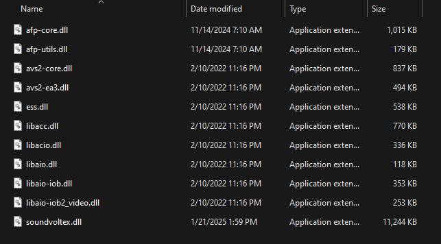

??? tips "我有一个`dev`文件夹"

    dev文件夹存放的是游戏配置信息，没有的情况下可使游戏恢复出厂设置并重新生成配置信息

    你可以选择保留，或者删除并在初次启动时重新矫正旋钮

## 安装Spice2x

!!! info ""

    [Spice2x](https://spice2x.github.io/){ .md-button .md-button--primary }

    从上方的网站下载最新稳定版本

    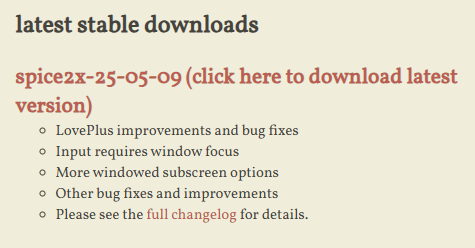

    下载后应该如图

    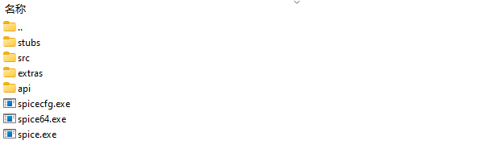

    你只需要将`spicecfg`,`spice64.exe`，解压到游戏目录与data平级即可完成安装

    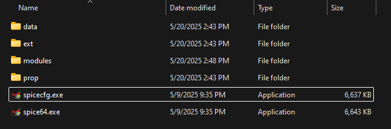

??? warning "如果你是AMD/Intel显卡的用户"

    你还需要将spice压缩包里的`stubs/64`里的三个dll文件复制到游戏目录的`modules`文件夹里，其余的文件是没必要的

    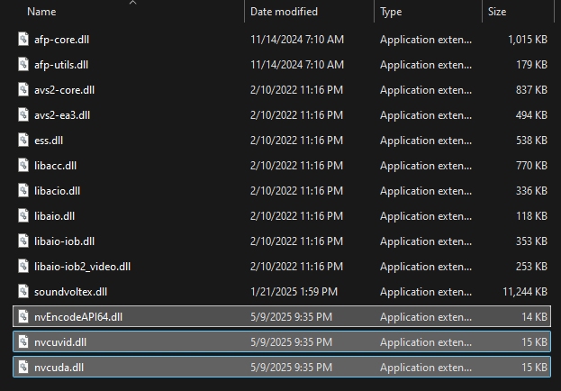

## 设置Spice2X

### Buttons

!!! info ""

    绑定你控制器，需要绑定的按键如下图，点击Bind，找到对应的按钮按下即可

    对于旋钮，你需要绑定Analogs页面里的`VOL-L`，`VOL-R`，而不是Buttons页面的`VOL-L Left`，`VOL-L Right`，`VOL-R Left`，`VOL-R Right`

    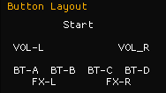

    除此以外你还需要绑定`Service`键与`Test`键用于调整游戏内配置，个人习惯是F1绑定Service，F2绑定Test

    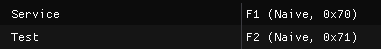

??? tips "Bind与Naive的区别"

    Bind会跟随硬件，例如你绑定了法务司手台，插上源台需要重新绑定一次，手台按钮通常使用这个绑定

    Naive则是使用特征码，无论什么设备只要输出的是相同的特征码即可通用，一般用于绑定键盘

    同时在2025-05-09版本后的spice，绑定Naive的键在窗口不在前台时（或者说不在焦点时）不会被游戏接受，Bind则保持原来的模式

### Cards
!!! danger "请妥善保管你的卡号以免泄露"

!!! info ""

    此处设定你的卡号，对于SDVX，你只需要设置Player 1，如果你没有实体卡，请点击`Generate`生成一个虚拟卡号，生成后会在游戏目录生成`card0.txt`保存

    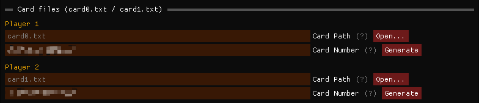

    如果你有实体卡，且拥有读卡器，请根据读卡器卖家的说明开启spice里对应的模块，在下方的NFC card reader status读卡即可获取你实体卡NFC ID（IDm）形式的一串卡号，填入Player 1的Card Number即可（并非卡背后的Access Code）

    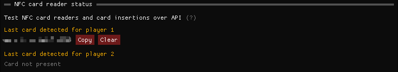

    如果你有实体卡，但没有读卡器，你可以在以下任意一个网站里转换Access Code为NFC ID（IDm）

    - [card.bsnk.me](https://card.bsnk.me/)

    如果你使用iPhone，你可以在应用商店下载"NFC Tools"，读卡，Serial Number去掉冒号就是NFC ID（IDm）

    如果你使用日版安卓机（支持Osaifu-Keidai与Felica），也可以用上述方法读取

### Patches

!!! info ""

    此处用于给游戏打补丁，修改游戏

    新安装的游戏不会在这里有任何东西，你需要点击`Import from URL`导入补丁，可从以下两个地址导入

    - https://sp2x.two-torial.xyz

    - https://cdn.jsdelivr.net/gh/two-torial/sp2xpatcher/patches/

    优先使用第一个，如果你所在的中国大陆地区屏蔽Github将无法访问第一个，请使用第二个

    Overwrite game files表示将补丁硬编码至文件（不建议）

    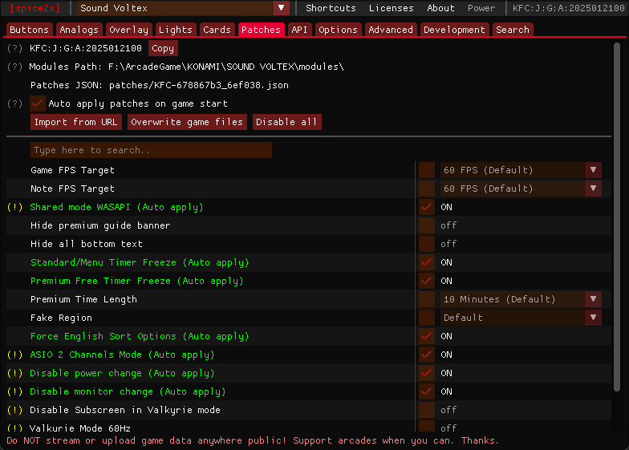

    !!! warning

        请仅打需要的补丁，不要启用你不知道的

    | 功能 | 说明 | 推荐值 |
    | --- | --- | --- |
    | `Game FPS Target` | 游戏目标帧率 | 推荐不启用，如果帧率不对则60FPS for 60Hz屏幕，120FPS for 120Hz以上屏幕 |
    | `Note FPS Target` | 铺面目标帧率 | 同上 |
    | `Shared mode WASAPI` | 共享式WASAPI | 建议保持关闭以保证最佳延迟，如果没有声音或需要游戏以外的声音请开启 |
    | `Hide premium guide banner` |  | |
    | `Hide all bottom text` | 隐藏底栏的文字（PASELI，CREDIT） | 都可 |
    | `Standatd/Menu Timer Freeze` | 标准/菜单计时器冻结 | On |
    | `Premium Free Timer Freeze` | 自由模式计时器冻结 | On | 
    | `Premium Time Length` | 由模式计时器时长 | 不启用冻结时自行延长 |
    | `Fake Region` | 区域伪装 |  |
    | `Force English Sort Optons` | 分类菜单使用英语 | 都可 |
    | `ASIO 2 Channels Mode` | ASIO模式使用2通道 | 如果你使用的声卡没有多通道则On |
    | `Disable power change` | 禁用电源选项更改 | On |
    | `Disable monitor change` | 禁用显示器更改 | On |
    | `Disable Subscreen in Valkyrie mode` | 女武神模式下禁用副屏幕 | 都可 |
    | `Valkyrie Mode 60Hz` | 女武神模式使用60Hz刷新率 | 建议Off |
    | `Force BIO2（KFC）IO in Valkyrie mode` | 强制Valkyrie使用Nemsys的IO | Off，如果使用框体则自行考虑 |
    | `Force Enable Headphones` | 强制启用耳机孔检测 | 都可 |


