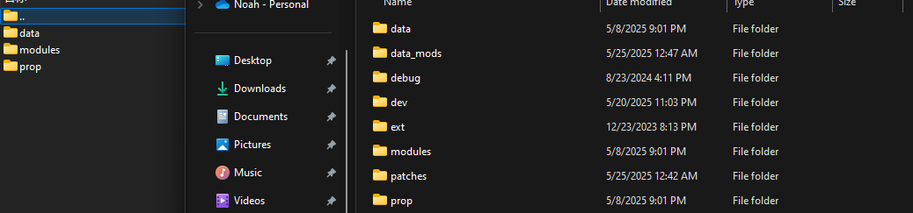
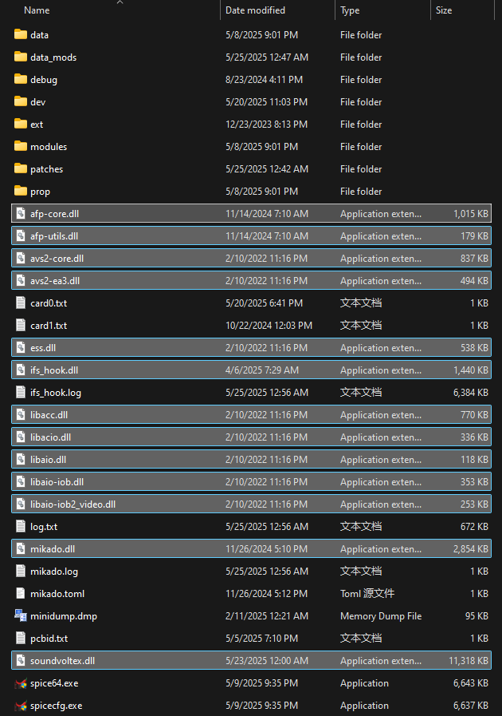

# 更新

!!! info ""

    更新通常分为以下步骤：

    - 更新本体
    - 更新氧无插件
    - 更新Datecode
    - 重新Patch
    - 清除data_mods缓存

!!! info ""

    更新包的格式应该如下

    `KFC-当前版本-to-更新版本`

    

## 更新本体

!!! info ""

    打开压缩包，将包内的文件夹覆盖游戏文件夹的同名文件夹

    

!!! tips "提示"

    有时可能不会如图，可能会多几个/少几个文件夹，但是通常来讲`data`，`modules`是肯定会有的

<!-- ??? warning "懒人包更新必看！！！"

    如果你使用的懒人包，更新包覆盖有所不同，你需要在覆盖了以后将`modules`文件夹里的所有`.dll`挪到上一级菜单，如图，才能生效

     -->

## 更新氧无插件

!!! info ""

    更新插件请从[22vv0/asphyxia_plugins](https://github.com/22vv0/asphyxia_plugins/releases)下载最新版本的插件

    回到插件目录，删除里面所有的文件并重新解压新插件里的内容并替换

    

!!! warning "注意"

    如果你导入过WebUI Assets，可以保留`webui`文件夹并删除其他文件夹，再解压覆盖新插件进来

## 更新Datecode

!!! info ""

    覆盖文件以后，你需要打开`prop/ea3-config.xml`，更改Datecode

    ```xml hl_lines="6"
    <soft>
        <model __type="str">KFC</model>
        <dest __type="str">J</dest>
        <spec __type="str">G</spec>
        <rev __type="str">A</rev>
        <ext __type="str">2025042202</ext>
    </soft>
    ```
    以及`prop/bootstrap.xml`，检查Datecode是否与`ea3-config`一致

    ```xml
    <release_code>2025042202</release_code>
    ```

## 重新应用Patch

!!! info ""

    更新以后需要在`spicecfg`里重新应用补丁，具体详见[部署里的Patches](setup.md#patches)

## 重建缓存（打Mod用户必须！）

!!! info ""

    进入`data_mods`文件夹，删除`_cache`文件夹重建缓存，否则歌曲类的Mod将会和更新包冲突导致不显示新歌