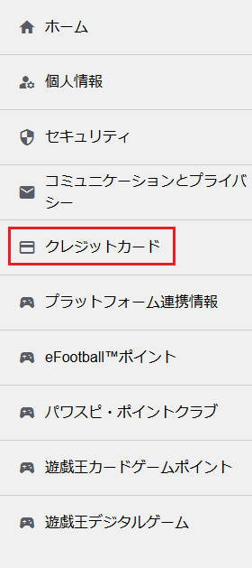
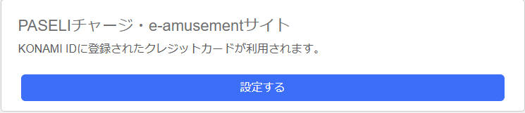
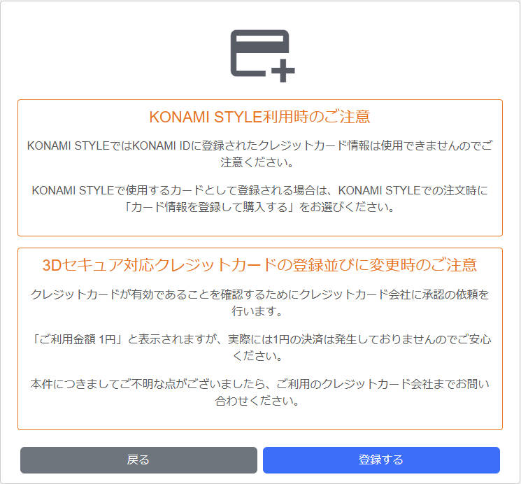
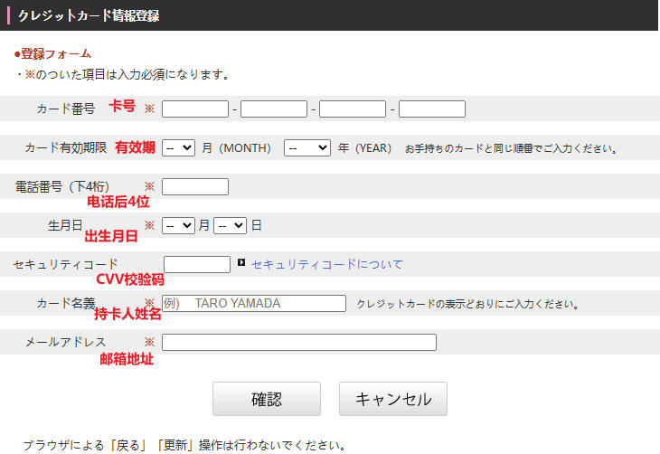
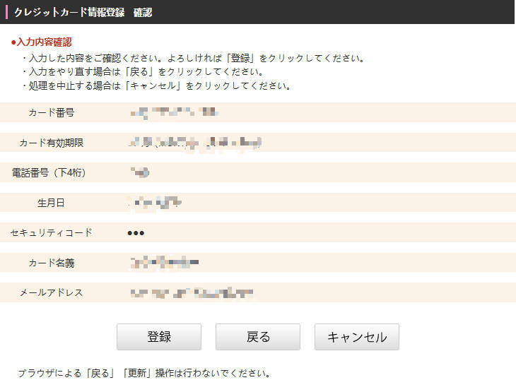

## 绑定信用卡

!!! info ""

    首先此处的信用卡并不一定是信用卡，是Visa或者MasterCard或者JCB的应该都可以绑定，所以部分外币储蓄卡也行，经过实测中银长城Visa卡/汇丰蓝狮子MasterCard扣账卡均可以绑定与付款，下文以蓝狮子为例

    首先我们打开Konami ID的官网，登录你的账号

    [My KONAMI](https://my.konami.net){ .md-button .md-button--primary }

    在账户的后台，找到`クレジットカード（Credit Card）`这一栏，进入

    

    找到`PASELIチャージ・e-amusementサイト`这一栏，点击设定

    

    阅读注意事项，点击`登録する`，并同意

    

    根据内容填写对应的信息

    

    确认信息，发卡行认证后即可，此处会扣除1日元做有效性验证

    
