# 部署

!!! warning

    家用版需要全程科学上网使用日本节点并且使用TUN模式，使用系统代理模式将不会被接管

    如果你使用的加速器有家用版的加速也可以使用

    下文将默认你已经科学上网

----

## 注册账号

!!! info ""

    [SOUND VOLTEX コナステ](https://p.eagate.573.jp/game/eacsdvx/vi/index.html){ .md-button .md-button--primary }

    打开官网，点击右上角的Login，进入账号登录/注册页面

    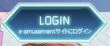

    点击注册按钮注册KONAMI ID，注意事项如下：

    - 出生年月日清确保18岁以上

    - 国家地区一定要选日本（Japan）

    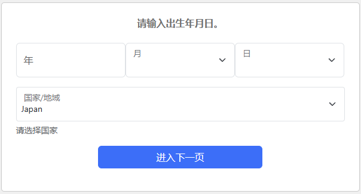

    注册完成后自动跳转，首次登录会提示你链接，同意即可，还有是否接受营销邮件，同意许可条款

    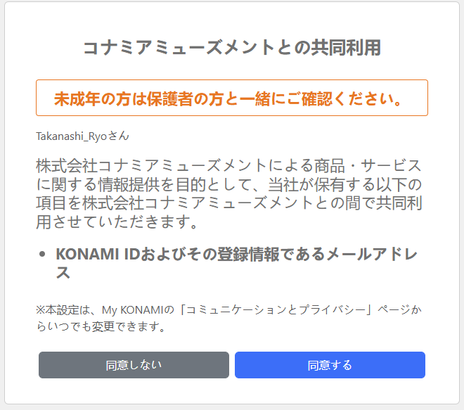

    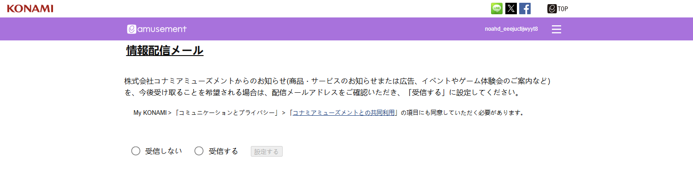

    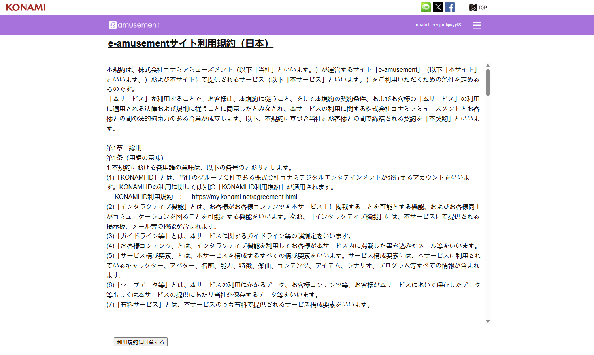

    然后会让你创建个人资料，这里的个人资料是e-amusement这个平台的，虽然都是使用KONAMI ID登录但本质是两个不同的分公司管理

    按照自己的需求填写，每行意思分别是

    - 昵称

    - 出生年月日（无法修改，随注册账号时的设定）

    - 性别

    - 好友列表

    - 群组列表

    - 其他

    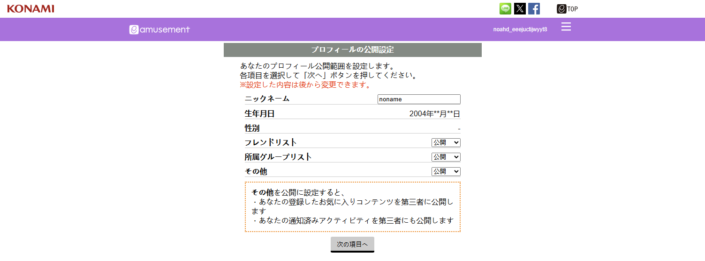

    确定后是设置头像，之后会跳转回去

    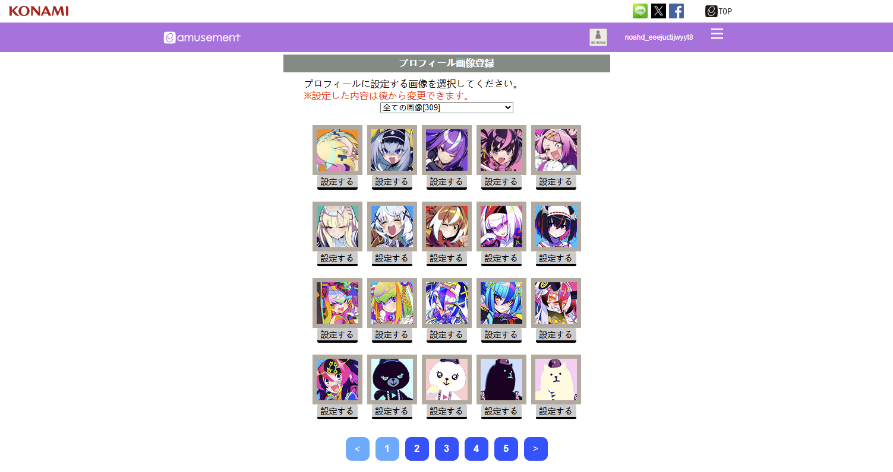

----

## 下载启动器

!!! info ""

    此时我们返回家用版的官网，登录账号，他就变成了这样，我们点击Install

    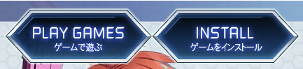

    这里点击`同意してインストーラーをダウンロード`下载安装程序

    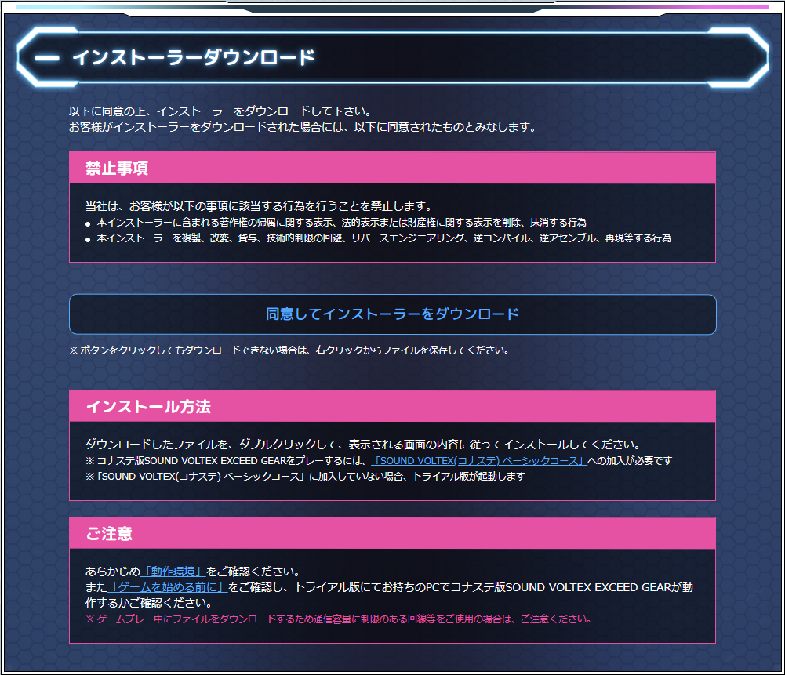

    之后根据安装程序的说明一直下一步即可

!!! danger

    需要注意的是安装程序设定安装目录的页面
    
    - 第一行是游戏本体目录

    - 第二行是追加资源下载目录
    
    **_请确保你没有将游戏安装在根目录（例如`C:/`），请一定要设定一个文件夹给他安装(例如`C:/SOUND VOLTEX`)，否则在卸载的时候会清空你的磁盘！！！！_**

    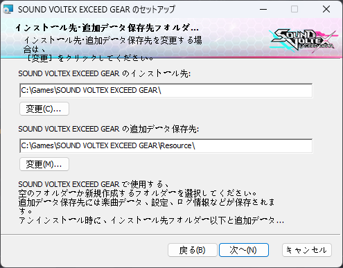

----

## 初次启动

!!! info ""

    打开启动器，他会弹出网页要求你登录，登录后初次可能会有一个许可条款，也是同意即可

    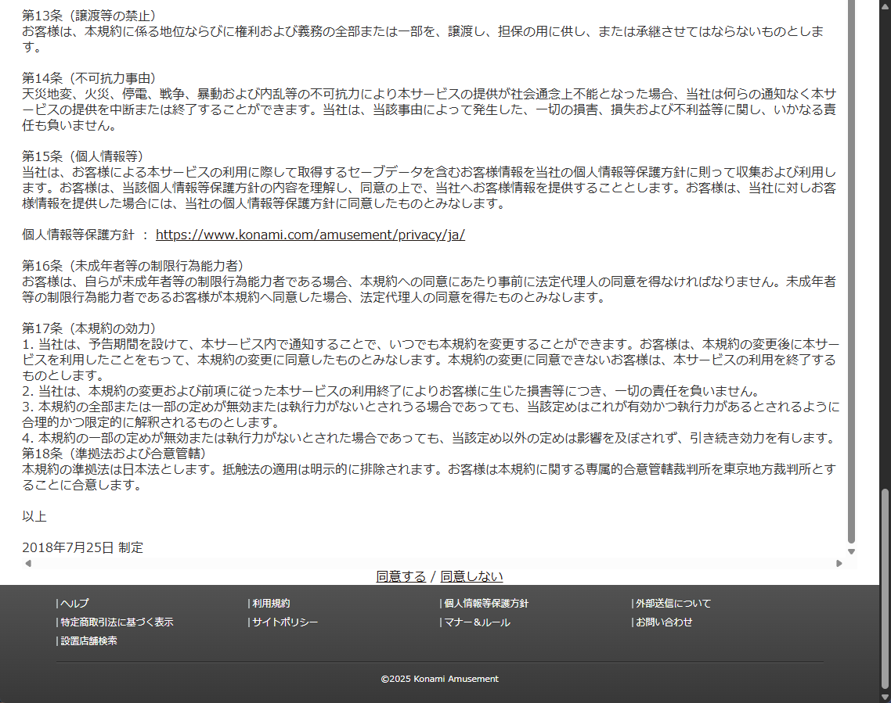
    
    之后由于是新号，会有一个页面，有三个选项，分别是

    - 注册已经使用的e-amusement pass

    - 注册拥有但未使用的e-amusement pass

    - 新建一个虚拟e-amusement pass

    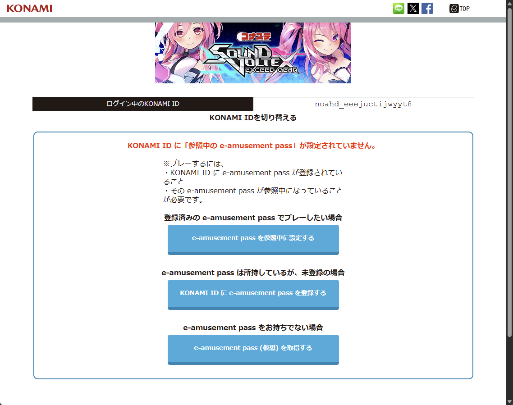

### 创建虚拟e-amusement pass

!!! info ""

    我们以虚拟e-pass为例，点击后会让你输入通行代号，4位数字，不能设定4位相同数字（0000）

    完成后点击`e-amusement pass(仮想)を発行して登録する`生成

    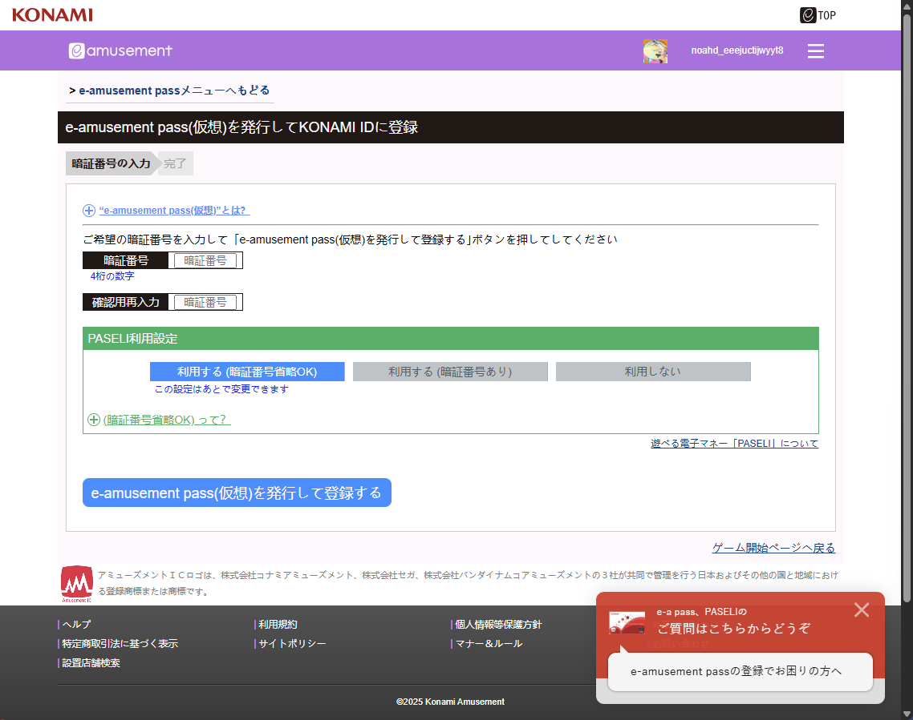

    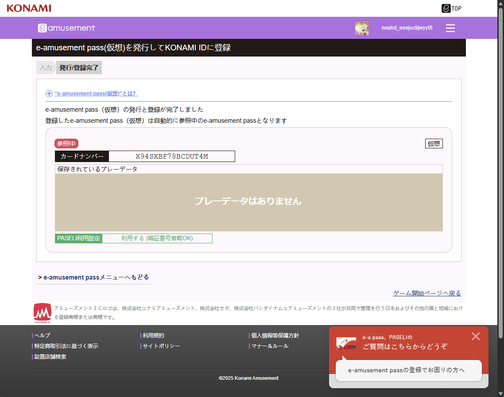

### 绑定未使用的e-amusement pass

!!! info ""

    如果你已经购买了一张e-pass，无论是红白，还是带限定图案的，都可以绑定在账号上

    打开 [e-amusement pass Menu](https://p.eagate.573.jp/gate/eapass/menu.html)

    此处会显示你刚才创建的虚拟卡，点击下方的`新規のe-amusement passをKONAMI IDに登録`绑定一张未注册的新卡，从上到下依次是

    - 卡号（卡背后的20位数字）

    - 通行代码

    - 确认通行代码

    填写完成后点击`登録する`即可

    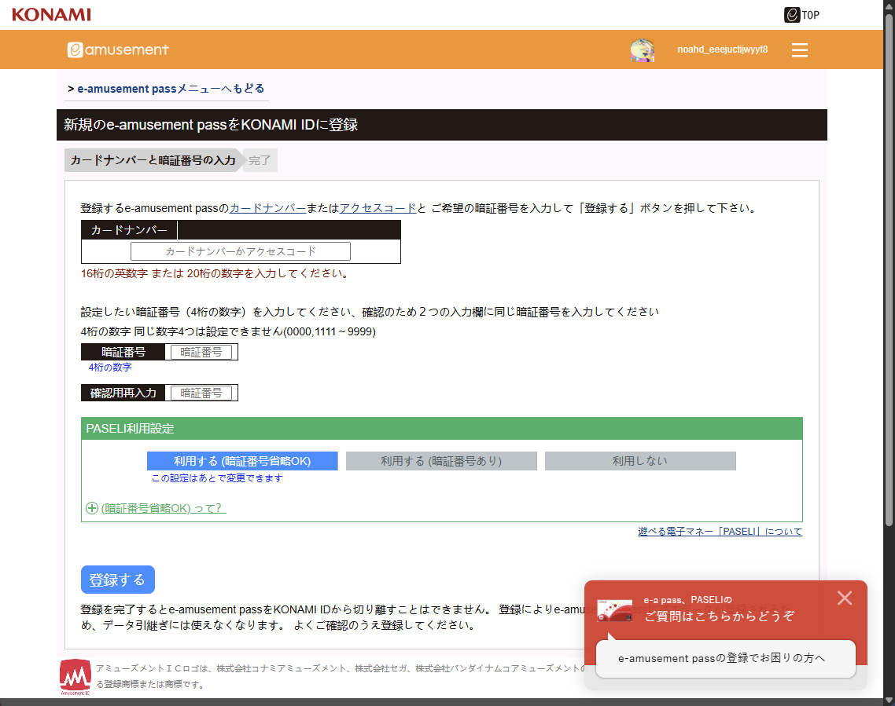

### 绑定已使用的e-amusement pass

!!! info ""

    如果你已经在拥有官机的地区游玩过，你可以直接绑定那张刷过的卡在你的账户里

    打开 [e-amusement pass Menu](https://p.eagate.573.jp/gate/eapass/menu.html)

    点击下面的`利用中のe-amusement passをKONAMI IDに登録`绑定一张已注册的新卡

    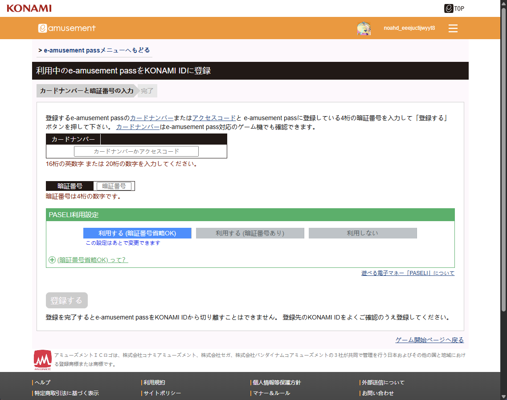

### 选择默认卡

!!! info ""

    如果你绑了多张卡，可以在 [e-amusement pass Menu](https://p.eagate.573.jp/gate/eapass/menu.html)，点击`e-amusement passを切り替える`切换卡片

    通过上方的箭头选择你要使用的卡，然后点击卡号左上角的`参照する`设定默认卡

    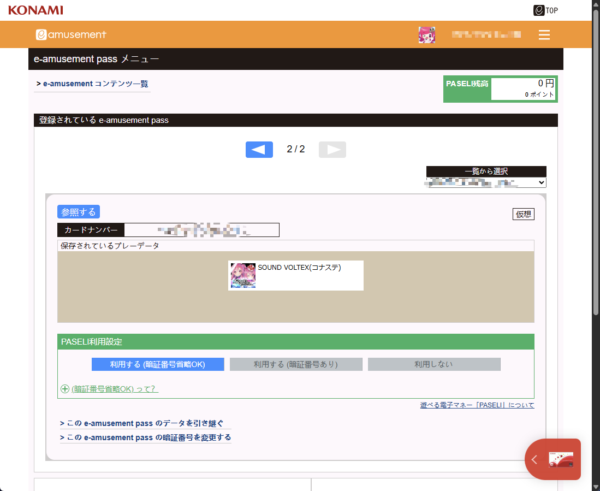

!!! warning 

    无论是虚拟卡还是实体卡，每个卡号里的数据都是单独的，如果你想要你家用版的数据可以在官机上应用，请确保使用的都是实体卡，反之亦然

----

## 安装游戏

!!! info ""

    完成后我们重新开一遍游戏
    
    点击`ゲーム起動`，并同意启动程序

    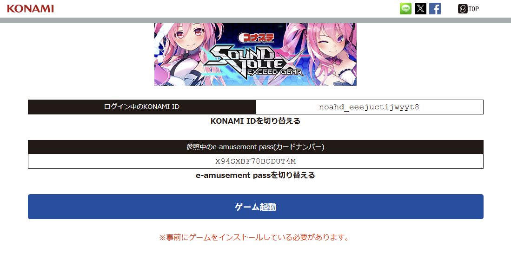

    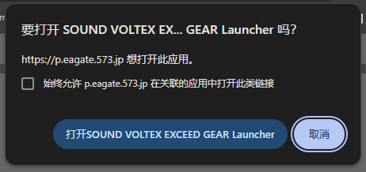

    此时启动器会弹出，并且有一个乱码的弹窗，这里是要你下载额外的资源，直接点击OK即可

    

    在新弹出的窗口点击`Update`，下载大概需要8GB左右

    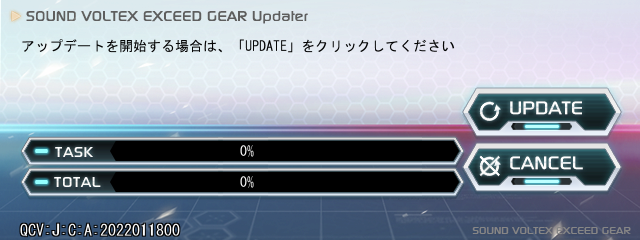

!!! warning 

    这玩意下载速度贼慢，科学上网都救不了，下不动慢慢等，也可以尝试将科学上网改成全局模式而非规则