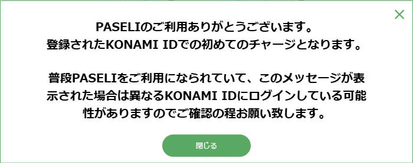
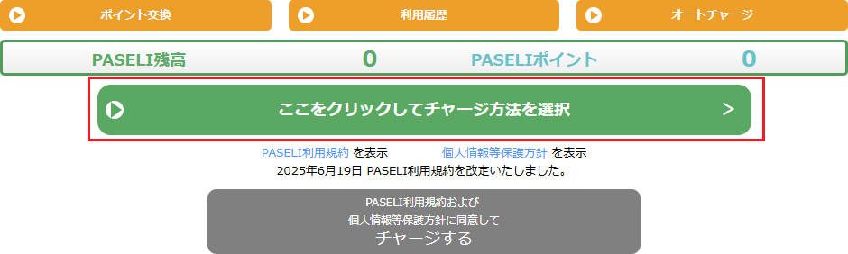
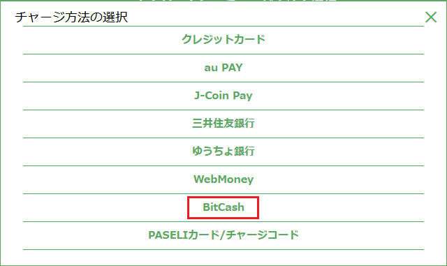
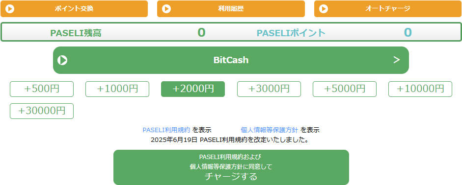
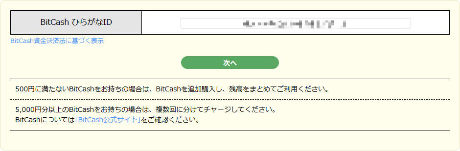
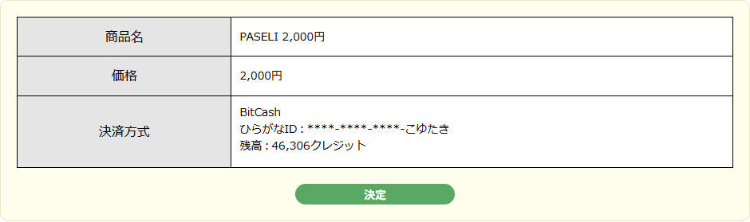
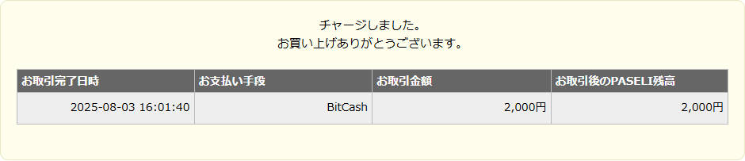

# 订阅游戏

家用版采用月付制，每个月1628日元

[购买地址](https://p.eagate.573.jp/payment/p/ex_course_detail.html?course=eac_sdvx_basic)

## 充值PASELI

!!! info ""

    家用版支持PASELI与信用卡付款，不支持中国大陆的支付方式，也不支持银联，莫奈卡/长城卡实测可绑定但未尝试支付，有待测试，所以留给我们的只剩下了PASELI，PASELI可以在淘宝买到其对应充值方式的点卡，我们需要购买对应的点卡充值劵并充值到账户里，这里推荐使用BitCash充值，在淘宝直接搜索，买好充值卡后我们打开PASELI的官网

    [PASELI](https://paseli.konami.net/charge){ .md-button .md-button--primary }

    此时如果你是初次充值会弹出这个窗口，表示你是第一次充值，你可以通过此窗口来鉴别你登录的时候是正确的账户

    

    我们点击这个按钮来进入充值页面

    

    点击BitCash

    

    选择你要充值的面额，点击充值

    

    输入16位的假名点卡

    

    确定

    

    此时就完成了充值

    

## 订阅游戏

!!! info ""

    完成PASELI的充值后，我们进入这个页面

    [订阅游戏](https://p.eagate.573.jp/payment/p/ex_course_detail.html?course=eac_sdvx_basic){ .md-button .md-button--primary }

    点击`了承する`

    

    确定选择的是PASELI支付，点击下一步

    

    输入KONAMI ID的账户密码，点击确定

    

    完成订阅

    

    此时再回去就可以看到订阅状态与续费时间

    

## 启动游戏

!!! info ""

    此时你就可以启动游戏游玩了

    